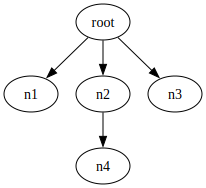

# GraphMaster - A Graph Manager Powered by Graphviz

Created by me, [Johnny Salazar](https://github.com/itsJohnny21/itsJohnny21), for my CSE 467 (Software QA and Testing) course, taught by professor [Xusheng Xiao](https://xusheng-xiao.github.io/).


## FOR GRADERS ONLY

### What's new in Project Part 3?

#### Refactorings

The code based was `refactored` to `improve readability` and `remove duplicate code`. The following are the sections of code that were refactored:

##### parseDot (BEFORE)

```java
// BEFORE
public static Graph parseDOT(String filepath) {
    try {
        MutableGraph mutableGraph = new Parser().read(new File(filepath));
        String graphID = mutableGraph.name().toString();

        Graph graph = graphID.isEmpty() ? new Graph() : new Graph(graphID);
        mutableGraph.graphAttrs().forEach(a -> {
            graph.setAttribute(a.getKey(), a.getValue().toString());
        });

        for (MutableNode node : mutableGraph.nodes()) {
            String nodeID = node.name().toString();
            Node nodeCopy;

            if (!graph.nodeExists(nodeID)) {
                nodeCopy = graph.addNode(nodeID);
            } else {
                nodeCopy = graph.getNode(nodeID);
            }

            node.attrs().forEach(a -> {
                nodeCopy.setAttribute(a.getKey(), a.getValue().toString());
            });
            node.links().forEach(l -> {
                LinkTarget toNode = l.to();
                String toNodeID = toNode.name().toString();
                Node toNodeCopy;

                if (!graph.nodeExists(toNodeID)) {
                    toNodeCopy = graph.addNode(toNodeID);
                } else {
                    toNodeCopy = graph.getNode(toNodeID);
                }

                Edge edge = graph.addEdge(nodeCopy.ID, toNodeCopy.ID);

                l.attrs().forEach(a -> {
                    edge.setAttribute(a.getKey(), a.getValue().toString());
                });
            });
        }

        return graph;
    } catch (guru.nidi.graphviz.parse.ParserException | IOException e) {
        throw new ParseException(String.format("Error: Unable to parse graph: %s", e.getMessage()));
    }

    #### Refactorings
    }
```

##### parseDot (AFTER)

```java
// AFTER
public static Graph parseDOT(String filepath) {
    try {
        MutableGraph mutableGraph = new Parser().read(new File(filepath));
        String graphID = mutableGraph.name().toString();

        Graph graph = graphID.isEmpty() ? new Graph() : new Graph(graphID);

        //! Extract method
        applyGraphAttributesFromDOT(graph, mutableGraph);

        //! Extract variable
        addNodesFromDOT(graph, mutableGraph);

        //! Extract variable
        addEdgesFromDOT(graph, mutableGraph);

        return graph;
    } catch (ParserException | IOException e) {
        throw new ParseException(String.format("Error: Unable to parse graph: %s", e.getMessage()));
    }
}
```

##### Type of refactoring for parseDot

For the `parseDot` refactoring, three methods were **extracted**:

- `applyGraphAttributesFromDOT`: applies the attributes from a `MutableGraph` object (from Guru Nidi) to a `Graph` object
- `addNodesFromDOT`: converts MutableNode objects (from Guru Nidi) to `Node` objects and adds it to a `Graph`
- `addEdgesFromDOT`: converts Link objects (from Guru Nidi) to `Edge` objects and adds it to a `Graph`

#### Refactorings

These extractions improve readability and maintainability.

##### removeNode (BEFORE)

```java
// BEFORE
public void removeNode(String nodeID) {
    if (!nodeExists(nodeID)) {
        throw new NodeDoesNotExistException(
                String.format("Error: Attempt to remove node '%s' failed. Node does not exist.", nodeID));
    }

    Node node = getNode(nodeID);

    for (Iterator<Entry<String, Node>> it = node.to.entrySet().iterator(); it.hasNext();) {
        Entry<String, Node> entry = it.next();
        Node toNode = entry.getValue();
        toNode.from.remove(node.ID);

        String edgeID = Graph.createEdgeID(node.ID, toNode.ID);
        edges.remove(edgeID);
        it.remove();
    }
    for (Iterator<Entry<String, Node>> it = node.from.entrySet().iterator(); it.hasNext();) {
        Entry<String, Node> entry = it.next();
        Node fromNode = entry.getValue();
        fromNode.to.remove(node.ID);

        String edgeID = Graph.createEdgeID(fromNode.ID, node.ID);
        edges.remove(edgeID);
        it.remove();
    }

    nodes.remove(node.ID);
    node.setGraph(null);

    #### Refactorings
}
```

##### removeNode (AFTER)

```java
// AFTER
public void removeNode(String nodeID) {
    if (!nodeExists(nodeID)) {
        throw new NodeDoesNotExistException(
            String.format("Error: Attempt to remove node '%s' failed. Node does not exist.", nodeID));
    }

    Node node = getNode(nodeID);

    //! Extract method
    node.clearTo();

    //! Extract method
    node.clearFrom();

    nodes.remove(node.ID);
    node.setGraph(null);
}
```

##### Type of refactoring for removeNode

For the `removeNode` refactoring, two methods were **extracted**:

- `node.clearTo`: clears the list of nodes that a particular node is connected to
- `node.clearFrom`: clears the list of nodes that a particular node is connected from

#### Refactorings

These extractions improve readability and maintainability.

##### addEdge (BEFORE)

```java
// BEFORE
public Edge addEdge(String fromID, String toID) {
    if (edgeExists(fromID, toID)) {
        throw new EdgeAlreadyExistsException(
                String.format("Error: Edge with id '%s' already exists.", Graph.createEdgeID(fromID, toID)));
    }

    Node fromNode = nodeExists(fromID) ? getNode(fromID) : addNode(fromID);
    Node toNode = nodeExists(toID) ? getNode(toID) : addNode(toID);

    Edge edge = new Edge(fromNode, toNode);
    fromNode.to.put(toNode.ID, toNode);
    toNode.from.put(fromNode.ID, fromNode);
    edges.put(edge.ID, edge);
    return edge;

    #### Refactorings
}
```

##### addEdge (AFTER)

```java
// AFTER
public Edge addEdge(String fromID, String toID) {
    if (edgeExists(fromID, toID)) {
        throw new EdgeAlreadyExistsException(
                String.format("Error: Edge with id '%s' already exists.", Graph.createEdgeID(fromID, toID)));
    }

    //! Code reuse
    Node fromNode = addOrGetNode(fromID);

    //! Code reuse
    Node toNode = addOrGetNode(toID);

    Edge edge = new Edge(fromNode, toNode);

    fromNode.to.put(toNode.ID, toNode);
    toNode.from.put(fromNode.ID, fromNode);
    edges.put(edge.ID, edge);
    return edge;
}
```

##### Type of refactoring for addEdge

#### Refactorings

For the `addEdge` refactoring, the `addOrGetNode` method was **reused**, resulting in fewer lines of code and improved maintainability.

##### addPath (BEFORE)

```java
// BEFORE
public Path addPath(String... nodeIDs) {
    if (nodeIDs.length == 0) {
        return null;
    }

    Node[] nodes = new Node[nodeIDs.length];
    nodes[0] = nodeExists(nodeIDs[0]) ? getNode(nodeIDs[0]) : addNode(nodeIDs[0]);

    Edge[] edges = new Edge[nodeIDs.length - 1];

    for (int i = 0; i < nodeIDs.length - 1; i++) {
        String fromNodeID = nodeIDs[i];
        String toNodeID = nodeIDs[i + 1];

        Edge edge = edgeExists(fromNodeID, toNodeID) ? getEdge(fromNodeID, toNodeID)
                : addEdge(fromNodeID, toNodeID);
        edges[i] = edge;

        nodes[i + 1] = edge.toNode;
    }

    Path path = new Path(nodes, edges);
    return path;

    #### Refactorings
}
```

##### addPath (AFTER)

```java
// AFTER
public Path addPath(String... nodeIDs) {
    if (nodeIDs.length == 0) {
        return null;
    }

    //! Rename from nodes to nodesArray
    Node[] nodesArray = new Node[nodeIDs.length];
    nodesArray[0] = nodeExists(nodeIDs[0]) ? getNode(nodeIDs[0]) : addNode(nodeIDs[0]);

    //! Rename from edges to edgesArray
    Edge[] edgesArray = new Edge[nodeIDs.length - 1];

    for (int i = 0; i < nodeIDs.length - 1; i++) {
        String fromNodeID = nodeIDs[i];
        String toNodeID = nodeIDs[i + 1];

        Edge edge = edgeExists(fromNodeID, toNodeID) ? getEdge(fromNodeID, toNodeID)
                : addEdge(fromNodeID, toNodeID);
        edgesArray[i] = edge;

        nodesArray[i + 1] = edge.toNode;
    }

    Path path = new Path(nodesArray, edgesArray);
    return path;
}
```

##### Type of refactoring for addPath

#### Refactorings

For the `addPath` refactoring, the `nodes` and `edges` variables were renamed to `nodesArray` and `edgesArray`. This was done to avoid hiding the `nodes` and `edges` attributes of a `Graph` and thus improves the code's readability (by avoiding confusion) reliability.

##### outputGraph (BEFORE)

```java
// BEFORE
public String outputGraph(String filepath, Format format, String... options)
        throws IOException, InterruptedException {
    String dotContent = toDot();

    if (!filepath.endsWith(format.extension)) {
        filepath += format.extension;
    }

    if (format.equals(Format.RAWDOT)) {
        try (BufferedWriter writer = new BufferedWriter(new FileWriter(filepath))) {
            writer.write(dotContent);
        }
    } else {

        List<String> command = new ArrayList<>();
        command.add("dot");
        command.add(format.value);
        command.add("-o");
        command.add(filepath);
        command.addAll(Arrays.asList(options));

        ProcessBuilder processBuilder = new ProcessBuilder(command);

        processBuilder.redirectErrorStream(true);
        Process process = processBuilder.start();

        try (OutputStream outputStream = process.getOutputStream()) {
            outputStream.write(dotContent.getBytes());
            outputStream.flush();
        }

        int exitCode = process.waitFor();

        if (exitCode != 0) {
            InputStream inputStream = process.getInputStream();
            String errorMessage = new String(inputStream.readAllBytes(), StandardCharsets.UTF_8);
            throw new ParseException(errorMessage);
        }
    }

    return dotContent;

    #### Refactorings
}
```

##### outputGraph (AFTER)

```java
// AFTER
public String outputGraph(String filepath, Format format, String... options)
        throws IOException, InterruptedException {
    String dotContent = toDot();

    if (!filepath.endsWith(format.extension)) {
        filepath += format.extension;
    }

    //! Extract variable
    boolean isRawDot = format.equals(Format.RAWDOT);

    if (isRawDot) {
        //! Extract method
        writeToFile(dotContent, filepath);
    } else {
        //! Extract method
        executeDotCommand(dotContent, filepath, format, options);
    }

    return dotContent;
}
```

##### Type of refactoring for outputGraph

For the `outputGraph` refactoring, the `isRawDot` variable was extracted and also the `writeToFile` and `executeDotCommand` methods were extracted:

- `isRawDot`: true if the `format` argument is of the type `RAWDOT`, otherwise false
- `writeToFile`: writes content to a file
- `executeDotCommand`: executes a dot command

These extractions improve readability and maintainability.

#### More refactorings

Note that additional refactorings were made but are not displayed in this section since the document only requires five refactorings to be shown and explained. The addition refactorings however have been commented and is shown in the following commit: [refactor](https:github.com)

#### Template method

The `graphSearchHelper` method was refactored to follow the Template Design Pattern. This new refactored method is called `graphSearchHelperTemplate` to differentiate itself. To achieve this, the following was performed:

- The abstract class `GraphSearcher` was created. Its purpose is to provide a skeleton for the search algorithm.
- The template method `search` for `GraphSearcher` was created and consists of the general steps for the search algorithm.
- The abstract method `pollContainer` for `GraphSearcher` was created to allow the child classes to poll a list of nodes, ultimately deciding the search algorithm to be used (either BFS or DFS).
- The concrete class `GraphSearcherBFS` was created and its `pollContainer` polls the first item from its list of nodes.
- The concrete class `GraphSearcherDFS` was created and its `pollContainer` polls the last item from its list of nodes.

The `GraphSearcher` class (and child classes) and the `graphSearchHelperTemplate` method are provided below:

```java
//! Abstract class
public abstract class GraphSearcher {
    private HashSet<Node> visited;
    private HashMap<Node, Node> prev;
    protected Queue container;
    private Path path = null;

    private void createVisitedSet() {
        this.visited = new HashSet<>();
    }

    private void createPrevSet() {
        this.prev = new HashMap<>();
    }

    protected void createContainer() {
        this.container = new Queue();
    }

    private void clear() {
        visited.clear();
        prev.clear();
        container.clear();
    }

    //! Abstract class
    protected abstract Node pollContainer();

    //! Template method
    protected void search(Node srcNode, Node dstNode) {
        if (visited == null) {
            createVisitedSet();
        }
        if (prev == null) {
            createPrevSet();
        }
        if (container == null) {
            createContainer();
        }

        searchForPath(srcNode, dstNode);
        clear();
    }

    private void searchForPath(Node srcNode, Node dstNode) {
        path = null;
        container.add(srcNode);
        visited.add(srcNode);

        boolean isContainerEmpty = container.isEmpty();

        while (!isContainerEmpty) {
            Node fromNode = pollContainer(); //! abstract method called

            boolean foundDstNode = fromNode.equals(dstNode);
            if (foundDstNode) {
                buildPath(dstNode);
                return;
            }

            for (Node toNode : fromNode.to.values()) {
                boolean alreadyVisitedToNode = visited.contains(toNode);

                if (!alreadyVisitedToNode) {
                    container.add(toNode);
                    prev.put(toNode, fromNode);
                    visited.add(toNode);
                }
            }
            isContainerEmpty = container.isEmpty();
        }

    }

    protected Path getResult() {
        return path;
    }

    private void buildPath(Node dstNode) {
        Node currentNode = dstNode;
        LinkedList<Node> nodesList = new LinkedList<>();
        nodesList.add(currentNode);
        LinkedList<Edge> edgesList = new LinkedList<>();

        while (prev.containsKey(currentNode)) {
            Node prevNode = prev.get(currentNode);
            Edge edge = prevNode.to(currentNode);
            edgesList.addFirst(edge);
            nodesList.addFirst(prevNode);

            currentNode = prevNode;
        }

        path = new Path(nodesList.toArray(Node[]::new), edgesList.toArray(Edge[]::new));
    }
}

//! Concrete class
public class GraphSearcherBFS extends GraphSearcher {
    @Override
    protected Node pollContainer() {
        return container.pollFirst();
    }
}

//! Concrete class
public class GraphSearcherDFS extends GraphSearcher {
    @Override
    protected Node pollContainer() {
        return container.pollLast();
    }
}

private Path graphSearchHelperTemplate(Node srcNode, Node dstNode, Algorithm algorithm) {
    GraphSearcher graphSearcher = algorithm.equals(Algorithm.BFS) ? new GraphSearcherBFS() : new GraphSearcherDFS();
    graphSearcher.search(srcNode, dstNode);
    return graphSearcher.getResult();
}
```

By following this Template Design Pattern, the code is now simpler and more maintainable.

#### Strategy method

The Strategy Design Pattern was already used to implement the `graphSearchHelper` method for `Graph`. To do this, the following was performed:

- The `Container` interface was created to act as a blueprint for a container during the search algorithm. Methods such as `poll`, `add`, `isEmpty`, and `clear`.
- The `Queue` class was created and extends Java's `LinkedList` class and also implements `Container`. This `poll` method for `Queue` removes the first element of its list.
- The `Stack` class was created and extends Java's `LinkedList` class and also implements `Container`. This `poll` method for `Stack` removes the last element of its list.

The `Container` interface, `Queue` class, `Stack` class, and `graphSearchHelper` method are show below:

```java
public interface Container {
    public Node poll();

    public boolean add(Node node);

    public boolean isEmpty();

    public void clear();
}

public class Queue extends LinkedList<Node> implements Container {
    @Override
    public Node poll() {
        return pollFirst();
    }
}

public class Stack extends LinkedList<Node> implements Container {
    @Override
    public Node poll() {
        return pollLast();
    }
}

private Path graphSearchHelper(Node srcNode, Node dstNode, Algorithm algorithm) {
    HashSet<Node> visited = new HashSet<>();
    Container container = algorithm.equals(Algorithm.BFS) ? new Queue() : new Stack();
    HashMap<Node, Node> prev = new HashMap<>();

    container.add(srcNode);
    visited.add(srcNode);

    while (!container.isEmpty()) {
        Node fromNode = container.poll();

        if (fromNode.equals(dstNode)) {
            return buildPath(dstNode, prev);
        }

        for (Node toNode : fromNode.to.values()) {
            if (!visited.contains(toNode)) {
                container.add(toNode);
                prev.put(toNode, fromNode);
                visited.add(toNode);
            }
        }
    }

    return null;
}

//! Method signature changed (srcNode unneeded)
private Path buildPath(Node dstNode, HashMap<Node, Node> prev) {
    Node currentNode = dstNode;
    //! Rename from nodes to nodesList
    LinkedList<Node> nodesList = new LinkedList<>();
    nodesList.add(currentNode);
    //! Rename from edges to edgesList
    LinkedList<Edge> edgesList = new LinkedList<>();

    while (prev.containsKey(currentNode)) {
        Node prevNode = prev.get(currentNode);
        Edge edge = prevNode.to(currentNode);
        edgesList.addFirst(edge);
        nodesList.addFirst(prevNode);

        currentNode = prevNode;
    }

    //! Improve readability
    Path path = new Path(nodesList.toArray(Node[]::new), edgesList.toArray(Edge[]::new));
    return path;
}
```

By following this Strategy Design Pattern, the code becomes more reusable, easier to read, and more maintainable.

#### Graph search random

The method `graphSearchRandom` is nearly identical to `graphSearch`. The only difference is that it shuffles a node's list of neighbours before iterating through them during the graph traversal. Both `graphSearchRandom` and `graphSearch` still produce the same output, but with `graphSearchRandom`, the visit sequence may be different every time it's executed on the same graph with the same source and destination nodes.

The following is the code for `graphSearchRandom`:

```java
private Path graphSearchHelperRandom(Node srcNode, Node dstNode, Algorithm algorithm) {
    HashSet<Node> visited = new HashSet<>();
    LinkedHashSet<Node> visitedExample = new LinkedHashSet<>();
    Container container = algorithm.equals(Algorithm.BFS) ? new Queue() : new Stack();
    HashMap<Node, Node> prev = new HashMap<>();

    container.add(srcNode);
    visited.add(srcNode);

    while (!container.isEmpty()) {
        Node fromNode = container.poll();
        visitedExample.add(fromNode);
        System.out.println(visitedExample);

        if (fromNode.equals(dstNode)) {
            return buildPath(dstNode, prev);
        }

        ArrayList<Node> neighbours = new ArrayList<>(fromNode.to.values());
        Collections.shuffle(neighbours);

        for (Node toNode : neighbours) {
            if (!visited.contains(toNode)) {
                container.add(toNode);
                prev.put(toNode, fromNode);
                visited.add(toNode);
            }
        }
    }

    return null;
}
```

Also, to show that the visit sequences may differ with `graphSearchRandom`, a list of its visit sequences (for both BFS and DFS) will be provided in this [file](./assets/example_output.txt). The graph used to output this file is:

<div style="display: flex; flex-direction: row; justify-content: center; align-items: center;">
    
</div>

This file was generated from the following example code:

```java
public static void graphSearchRandom() throws Exception {
    Graph g = new Graph();
    g.addPath("a", "b", "c");
    g.addPath("b", "d", "e");
    g.addPath("b", "f", "g");
    g.addPath("b", "h", "i");
    g.addPath("e", "a");

    String methodName = new Exception().getStackTrace()[0].getMethodName();
    g.outputGraph(String.format("./assets/graphs/%s", methodName), Format.SVG);
    Path p;

    for (int i = 0; i < 5; i++) {
        // BFS
        System.out.println("BFS");
        p = g.graphSearchRandom("b", "a", Algorithm.BFS);
        System.out.println(p);

        // DFS
        System.out.println("DFS");
        p = g.graphSearchRandom("b", "a", Algorithm.DFS);
        System.out.println(p);
    }

    /*
    Example BFS visit sequence:
    [b]
    [b, c]
    [b, c, d]
    [b, c, d, f]
    [b, c, d, f, h]
    [b, c, d, f, h, e]
    [b, c, d, f, h, e, g]
    [b, c, d, f, h, e, g, i]
    [b, c, d, f, h, e, g, i, a]

    Resulting path:
    b -> d -> e -> a

    Example DFS visit sequence:
    [b]
    [b, h]
    [b, h, i]
    [b, h, i, f]
    [b, h, i, f, g]
    [b, h, i, f, g, d]
    [b, h, i, f, g, d, e]
    [b, h, i, f, g, d, e, a]

    Resulting path:
    b -> d -> e -> a
        */
}
```

#### Example of graph search

## Dependencies

This project is powered by Maven. To install the necessary dependencies, simply run the `mvn package` command. This will install the following:

- lombok (for setters and getters)
- sl4j-nop (for logging)
- graphviz-java (for parsing DOT files)
- junit-jupiter-engine (for JUnit testing)

After installing these dependencies, you can now begin creating your first graph!

## DOTElement

A `DOTElement` is an abstract class that serves the purpose of allowing its child classes to have [Attributes](#attributes). Any `DOTElement` can also be converted to an equivalent DOT element in the [DOT language](https://graphviz.org/doc/info/lang.html). There are three main types of `DOTElement`: [Graph](#graph), [Node](#node), [Edge](#edge).

### Setting an attribute

To give a `DOTElement` an attribute, you can do so by calling the `setAttribute` method that takes in an attribute (String) and value (String) as its arguments. The attribute and value will then be stored in a HashMap for quick access. The following is an example of setting some attributes for a `Graph` (a specific type of `DOTElement`):

```java
Graph g = new Graph();

g.setAttribute("custom_attribute", "some value");
g.setAttribute(Graph.Attribute.BGCOLOR, "red"); // Setting the "bgcolor" attribute to "red"
// g.setAttribute("bgcolor", "red"); // Equivalent way to set the same attribute
```

### Getting an attribute

To get an attribute from a `DOTElement`, you can use the `getAttribute`, which takes in an attribute (String), and uses it to retrieve the attribute's value.

```java
Graph g = new Graph();

g.setAttribute("custom_attribute", "some value");
g.setAttribute(Graph.Attribute.BGCOLOR, "red");
g.getAttribute(Graph.Attribute.BGCOLOR); // Retrieve attribute value is "red"
```

### Removing an attribute

Removing an attribute from a `DOTElement` can be achieved using the `removeAttribute` method, which takes in the attribute (String).

```java
Graph g = new Graph();

g.setAttribute("custom_attribute", "some value");
g.setAttribute(Graph.Attribute.BGCOLOR, "red");
g.removeAttribute(Graph.Attribute.BGCOLOR); // Attribute "bgcolor" removed
```

**_Note that the attribute methods apply to `Graph`, `Node` and `Edge` objects since all these classes are children of the `DOTElement` class._**

### Graph attributes

A `Graph` can be given attributes to store data and change its appearance.

This list of attributes was acquired from the official [Graphviz Graph Attributes page](https://graphviz.org/docs/graph/).

- \_BACKGROUND
- BB
- BEAUTIFY
- BGCOLOR
- CENTER
- CHARSET
- CLASS
- CLUSTERRANK
- COLORSCHEME
- COMMENT
- COMPOUND
- CONCENTRATE
- DAMPING
- DEFAULTDIST
- DIM
- DIMEN
- DIREDGECONSTRAINTS
- DPI
- EPSILON
- ESEP
- FONTCOLOR
- FONTNAME
- FONTNAMES
- FONTPATH
- FONTSIZE
- FORCELABELS
- GRADIENTANGLE
- HREF
- ID
- IMAGEPATH
- INPUTSCALE
- K
- LABEL
- LABEL_SCHEME
- LABELJUST
- LABELLOC
- LANDSCAPE
- LAYERLISTSEP
- LAYERS
- LAYERSELECT
- LAYERSEP
- LAYOUT
- LEVELS
- LEVELSGAP
- LHEIGHT
- LINELENGTH
- LP
- LWIDTH
- MARGIN
- MAXITER
- MCLIMIT
- MINDIST
- MODE
- MODEL
- NEWRANK
- NODESEP
- NOJUSTIFY
- NORMALIZE
- NOTRANSLATE
- NSLIMIT
- NSLIMIT1
- ONEBLOCK
- ORDERING
- ORIENTATION
- OUTPUTORDER
- OVERLAP
- OVERLAP_SCALING
- OVERLAP_SHRINK
- PACK
- PACKMODE
- PAD
- PAGE
- PAGEDIR
- QUADTREE
- QUANTUM
- RANKDIR
- RANKSEP
- RATIO
- REMINCROSS
- REPULSIVEFORCE
- RESOLUTION
- ROOT
- ROTATE
- ROTATION
- SCALE
- SEARCHSIZE
- SEP
- SHOWBOXES
- SIZE
- SMOOTHING
- SORTV
- SPLINES
- START
- STYLE
- STYLESHEET
- TARGET
- TBBALANCE
- TOOLTIP
- TRUECOLOR
- URL
- VIEWPORT
- VORO_MARGIN
- XDOTVERSION

### Node attributes

A `Node` can be given attributes to store data and change its appearance.

This list of attributes was acquired from the official [Graphviz Node Attributes page](https://graphviz.org/docs/nodes/).

- AREA
- CLASS
- COLOR
- COLORSCHEME
- COMMENT
- DISTORTION
- FILLCOLOR
- FIXEDSIZE
- FONTCOLOR
- FONTNAME
- FONTSIZE
- GRADIENTANGLE
- GROUP
- HEIGHT
- HREF
- ID
- IMAGE
- IMAGEPOS
- IMAGESCALE
- LABEL
- LABELLOC
- LAYER
- MARGIN
- NOJUSTIFY
- ORDERING
- ORIENTATION
- PENWIDTH
- PERIPHERIES
- PIN
- POS
- RECTS
- REGULAR
- ROOT
- SAMPLEPOINTS
- SHAPE
- SHAPEFILE
- SHOWBOXES
- SIDES
- SKEW
- SORTV
- STYLE
- TARGET
- TOOLTIP
- URL
- VERTICES
- WIDTH
- XLABEL
- XLP
- Z

### Edge attributes

A `Edge` can be given attributes to store data and change its appearance.

This list of attributes was acquired from the official [Graphviz Edge Attributes page](https://graphviz.org/docs/edges/).

- ARROWHEAD
- ARROWSIZE
- ARROWTAIL
- CLASS
- COLOR
- COLORSCHEME
- COMMENT
- CONSTRAINT
- DECORATE
- DIR
- EDGEHREF
- EDGETARGET
- EDGETOOLTIP
- EDGEURL
- FILLCOLOR
- FONTCOLOR
- FONTNAME
- FONTSIZE
- HEAD_LP
- HEADCLIP
- HEADHREF
- HEADLABEL
- HEADPORT
- HEADTARGET
- HEADTOOLTIP
- HEADURL
- HREF
- ID
- LABEL
- LABELANGLE
- LABELDISTANCE
- LABELFLOAT
- LABELFONTCOLOR
- LABELFONTNAME
- LABELFONTSIZE
- LABELHREF
- LABELTARGET
- LABELTOOLTIP
- LABELURL
- LAYER
- LEN
- LHEAD
- LP
- LTAIL
- MINLEN
- NOJUSTIFY
- PENWIDTH
- POS
- SAMEHEAD
- SAMETAIL
- SHOWBOXES
- STYLE
- TAIL_LP
- TAILCLIP
- TAILHREF
- TAILLABEL
- TAILPORT
- TAILTARGET
- TAILTOOLTIP
- TAILURL
- TARGET
- TOOLTIP
- URL
- WEIGHT
- XLABEL
- XLP

### Custom attributes

Each class `Graph`, `Node`, and `Edge` has its own nested attribute enums and purely exists for convenience. The attribute methods can either take in an appropriate attribute enum value, or it can take any string (as long it matches the [ID regex](#id-regex)). This means you can add custom attributes if needed.

## ID regex

A valid ID is required for many operations such as creating a `Graph` with a custom ID, creating a `Node`, setting an [Attribute](#attribute) for a `DOTElement`, etc. An ID is considered valid if it matches the ID regex which can be found in the `DotElement` class. This ID regex was acquired from the official [Graphviz Grammar page](https://graphviz.org/doc/info/lang.html).

### Valid ID examples

- a1 (letters followed by digits are allowed)
- \_a (underscore is allowed)
- 1 (digit can be the first character if the ID only contains digits)

### Invalid ID examples

- node A (whitespace is not allowed)
- node! ("!" is not allowed)
- 1a (cannot start with a digit if it contains non-numeric characters after it)

## Graph

A `Graph` consists of a set of [Node](#node) and [Edge](#edge) objects and automatically manages these objects when performing node and edge operations such as adding a node, removing a node, adding an edge, etc. Instances of its subclasses, `Node` and `Edge`, can only be created by a `Graph`. This composition relationship ensures that the nodes and edges can only live within a `Graph`. Each method of `Node` and `Edge` (besides the attribute methods) directly calls a method from its `Graph`, ensuring that all node and edge operations are done by the `Graph`. For example, the `connectTo` method of a `Node` simply calls its `Graph`'s `addEdge` method to create this edge.

See [examples](#examples) of creating a Graph.

### Create from scratch

To build a graph from scratch, you can choose from two constructors.

1. Constructor with no parameters. This will automatically give the the graph an ID equal to its Java hash code.

   ```java
   Graph g1 = new Graph();
   ```

2. Constructor with ID (String) parameter. You can manually provide your own ID for the graph.

   ```java
   Graph g2 = new Graph("Master");
   ```

The ID value (which must satisfy the [ID regex](#id-regex)) is final, meaning it cannot be modified after the `Graph` is created.

When [converting](#outputting-a-graph) the `Graph` into a DOT file, the `Graph`'s ID will be used as the name of the `Graph`. For example, [converting](#outputting-a-graph) `g2` into a DOT file will look like:

```dot
digraph Master {

}
```

Notice the graph is a digraph (directed graph). This tool will only create digraphs. Creating a regular graph is not an option. This is because a Graphviz digraph can perform all the functionalities a regular graph can perform, plus some more.

**_Note: As of currently, there is no support for creating undirected edges, but support for this feature will be available some time in the near future._**

### Create from a DOT file

Another way to create a `Graph` is by providing the path of a valid DOT file to the static `parseDOT` method provided by `Graph`. This static method utilizies the [Nidi3 graphviz-java](https://github.com/nidi3/graphviz-java) libarary to parse a DOT file by creating a MutableGraph object from graphviz-java, and then uses that MutableGraph object to add the nodes and edges (including all attributes) to the `Graph`. After parsing is complete, the `Graph` should contain all the nodes, edges, and their respective attributes from the DOT file.

The following is an example of parsing a valid [DOT file](./src/test/resources/DOT/valid/nodesX_Y_ZLabeled/nodesX_Y_ZLabeled.dot):

```Java
String dotPath = "./src/test/resources/DOT/valid/nodesX_Y_ZLabeled/nodesX_Y_ZLabeled.dot";
Graph g = Graph.parseDOT(dotPath);
```

### Add a node

The `Graph` object uses a nested class called `Node` to represent its nodes. There are no public constructors for this `Node` class, ensuring that it can only be created by a `Graph` via the `addNode` method. This method requires an [ID](#id-regex) (String) which will later be used by its `Graph` for quick access.

```java
Graph g = new Graph("Master");
Node n1 = g.addNode("n1"); // Add a node with ID "n1"
```

**_Note: If a node with ID "n1" already existed, this method would have thrown a `NodeAlreadyExists` exception._**

The ID will also be used to represent a node when converting the `Graph` into a DOT file. If we were to convert `g` into a DOT file, it would look like:

<div style="display: flex; flex-direction: row">
    <div
    style="
        display: flex;
        flex-direction: column;
        align-items: center;
        margin-right: 20px;
    "
    >
    <p>DOT</p>
<pre>
digraph Master {
    n1 [];
}
</pre>
    </div>
    <div
        style="
            display: flex;
            flex-direction: column;
            align-items: center;
            margin-left: 20px;
        "
        >
    <p>Result</p>
    
    </div>
</div>

Notice the empty brackets next to the node. These empty brackets contain the node's attributes, which in this case, the node has no attributes. To learn how to set and modify attributes for a [Node](#node), see [Attributes](#attributes).

### Check node existance

A `Graph` allows you to check if a `Node` exists. To do this, pass the `Node`'s ID into the `nodeExists` method. The method returns true if the `Node` exists, otherwise false.

```java
Graph g = new Graph("Master");
Node n1 = g.addNode("n1");

System.out.println(g.nodeExists("n1")); // true
System.out.println(g.nodeExists("n2")); // false
```

This method is useful to check if a `Node` exists before removing a `Node`.

### Add multiple nodes

For pure convenience, a `Graph` allows you to add multiple `Node` objects. This can be achieved using the `addNodes` method which takes in an array of IDs.

```java
Graph g = new Graph("Master");
g.addNode("n1");
String[] nodeIDs = new String[] { "n2", "n3", "n4" };
// String[] nodeIDs = new String[] { "n1", "n3", "n4" }; // NodeAlreadyExistsException thrown
// String[] nodeIDs = new String[] { "n2", "3_badID", "n4" }; // InvalidIDException thrown
// String[] nodeIDs = new String[] { "n2", "n2", "n4" }; // DuplicateNodeIDException thrown

g.addNodes(nodeIDs); // Add nodes "n2", "n3", and "n4"
```

Converting the graph `g` into a DOT file will result in the following:

<div style="display: flex; flex-direction: row">
    <div
    style="
        display: flex;
        flex-direction: column;
        align-items: center;
        margin-right: 20px;
    "
    >
    <p>DOT</p>
<pre>
digraph Master {
        n1 [];
        n2 [];
        n3 [];
        n4 [];
}
</pre>
    </div>
    <div
        style="
            display: flex;
            flex-direction: column;
            align-items: center;
            margin-left: 20px;
        "
        >
    <p>Result</p>
    
    </div>
</div>

**_Note: The IDs have to be unique, otherwise a a `DuplicateNodeIDException` will be thrown._**
**_Note: If a node with one of the provided IDs already exists when executing this method, a `NodeAlreadyExistsException` will be thrown._**
**_Note: If an invalid node ID is provided when executing this method, a `InvalidNodeIDException` will be thrown._**
**_Note: If any of the exceptions is thrown during execution of the method, no nodes will be added._**

### Get a node

To retrieve a `Node` from a `Graph`, you can simply call the `getNode` method and pass in the associated `Node`'s ID.

```java
Graph g = new Graph("Master");
g.addNode("n1");

Node n1 = g.getNode("n1"); // Get the node with ID "n1"
```

This method is useful for getting a `Node` that you don't have a direct reference to.

### Remove a node

A `Graph` can remove a `Node` by calling the `removeNode` method and passing in the `Node`'s [ID](#id-regex). This will also automatically remove any `Edge` associated with this `Node`. An example of a removing a `Node` from a complete digraph of size five is provided:

```java
Graph g = new Graph("Master");
int n = 5;

// Create the complete digraph of size 5
for (int i = 0; i < n; i++) {
    g.addNode(String.valueOf(i));
}

for (int i = 0; i < n; i++) {
    Node srcNode = g.getNode(String.valueOf(i));
    srcNode.getID();
    for (int j = 0; j < n; j++) {
        Node dstNode = g.getNode(String.valueOf(j));
        if (i != j) {
            srcNode.connectTo(dstNode);
        }
    }
}

g.removeNode("4");
// Node n4 = g.getNode("4");
// n4.removeFromGraph(); // An alternative method for removing a node
```

A total of five `Node` objects were created with IDs corresponding to their number in the creation process. After the complete digraph of size five was fully created, the `Node` with ID "4" `Node` was removed.

<div style="display: flex; justify-content: center;">
    <div style="display: flex; flex-direction: column; align-items: center;">
        <p>Before</p>
        
    </div>
    <div style="display: flex; flex-direction: column; align-items: center;">
        <p>After</p>
        
    </div>
</div>

Note that another way to remove a `Node` is by calling the `Node`'s `removeFromGraph` method. This method simply calls its `Graph`'s `removeNode` method and passes in its own [ID](#id-regex).

### Add an edge

The `Graph` object has another nested class called `Edge` that represents an directed edge between two `Node` objects in the `Graph`. Similarly to a `Node`, there are no public constructors. The `Graph`'s `addEdge` method can be used to create an `Edge` between two `Node` objects. Simply provide the IDs of the two `Node` objects to do so.

```java
Graph g = new Graph("Master");
Node n1 = g.addNode("n1");
Edge e1 = g.addEdge("n1", "n2"); // Add a directed edge between "n1" and "n2"
// Edge e1 = n1.connectTo(n2); // An alternative method to create the same exact edge using connectTo
// Edge e1 = n2.connectFrom(n1); // An alternative method to create the same exact edge using connectFrom
```

**_Note: If an edge already existed between nodes "n1" and "n2", then this method will throw a `EdgeAlreadyExists` exception._**
**_Note: If using connectTo or connectFrom, both nodes have to be from the same graph, otherwise a `DifferingGraphsException` will be thrown._**

Notice that prior to execution of this method, no `Node` with ID "n2" existed. The `Graph` automatically created this `Node` to make it even easier to create `Graph` objects. If you want to check if a `Node` exists, you can use the `nodeExists` method. After creating the `Edge`, it will have an ID "n1 -> n2". This `Edge` ID is automatically created by the static method `createEdgeID` from its `Graph`. This ID is final and will be used to represent an edge when converting the Graph into a DOT file. If we were to convert `g2` into a DOT file, it would look like:

<div style="display: flex; flex-direction: row">
    <div
    style="
        display: flex;
        flex-direction: column;
        align-items: center;
        margin-right: 20px;
    "
    >
    <p>DOT</p>
<pre>
digraph Master {
        n1 [];
        n2 [];<br>
        n1 -> n2 [];
}
</pre>
    </div>
    <div
        style="
            display: flex;
            flex-direction: column;
            align-items: center;
            margin-left: 20px;
        "
        >
    <p>Result</p>
    
    </div>
</div>

Another way to add an `Edge` is by using a `Node`'s `connectTo` method. The `Node` that calls the `connectTo` method will be the source `Node`, and the `Node` passed to this method will be the destination `Node`. Or conversely, you can use the `connectFrom` of the destination `Node` and pass in the source `Node`. Either way, the `Graph` will create a directed `Edge` from the source `Node` to the destination `Node`. These alternative methods are commented out in the prior example.

**_Note: If a node with the ID passed into `getNode` does not exist, then a `NodeDoesNotExistException` will be thrown._**

### Check edge existance

To check if an `Edge` exsits between two `Node` objects, you can use the `edgeExists` method provided by the `Graph`. Remember, order matters since all `Edge` objects are directed edges.

```java
Graph g = new Graph("Master");
Edge e1 = g.addEdge("n1", "n2");

System.out.println(g.edgeExists("n1", "n2")); // true
System.out.println(g.edgeExists("n1", "n1")); // false
```

This method is useful to check if a `Edge` exists before removing it.

### Get an edge

A `Graph` allows you to retrieve an `Edge` through the `getEdge` method which requires the IDs of the `Node` objects associated with that `Edge` in the correct order.

```java
Graph g = new Graph("Master");
g.addEdge("n1", "n2");

Edge e = g.getEdge("n1", "n2"); // Get the edge "n1 -> n2"
```

This method is useful for getting an `Edge` that you don't have a direct reference to.

### Remove an edge

To remove an `Edge` from a `Graph`, you can simply use the `removeEdge` method provided by its `Graph`. This method requires the IDs of the two `Node` objects connected by the `Edge`. The first parameter is the ID of the source `Node`, and the second parameter is the ID of the destination `Node`. **The order matters!** An example of removing an `Edge` from a complete digraph of size three is provided:

```java
Graph g = new Graph("Master");
int n = 3;

for (int i = 0; i < n; i++) {
    g.addNode(String.valueOf(i));
}

for (int i = 0; i < n; i++) {
    Node srcNode = g.getNode(String.valueOf(i));
    srcNode.getID();
    for (int j = 0; j < n; j++) {
        Node dstNode = g.getNode(String.valueOf(j));
        if (i != j) {
            srcNode.connectTo(dstNode);
        }
    }
}

g.removeEdge("2", "0");
```

A total of three `Node` objects were created with IDs corresponding to their number in the creation process. After the complete digraph of size five was complete, the `Edge` "2 -> 0" was removed.

<div style="display: flex; justify-content: center;">
    <div style="display: flex; flex-direction: column; align-items: center;">
        <p>Before</p>
        
    </div>
    <div style="display: flex; flex-direction: column; align-items: center;">
        <p>After</p>
        
    </div>
</div>

### Get number of nodes

For convenience, a `Graph` lets you get the `Node` count by calling the `getNumberOfNodes` method. This effectively returns the size of the graph's nodes HashMap.

```java
Graph g = new Graph("Master");
g.addNodes("n1", "n2", "n3");
g.addEdge("n4", "n5");

System.out.println(g.getNumberOfNodes()); // 5
```

<div style="display: flex; flex-direction: row">
    <div
    style="
        display: flex;
        flex-direction: column;
        align-items: center;
        margin-right: 20px;
    "
    >
    <p>DOT</p>
<pre>
digraph Master {
        n1 [];
        n2 [];
        n3 [];
        n4 [];
        n5 [];<br>
        n4 -> n5 [];
}
</pre>

### Get node names

For convenience, a `Graph` lets you get the IDs of its nodes by calling the `getNodeNames` method. This effectively returns the [ID](#ir-regex) of the `Node` objects in the nodes HashMap.

```java
Graph g = new Graph("Master");
g.addNodes("n1", "n2", "n3");

System.out.println(g.getNodeNames()); // [n1, n2, n3]
```

<div style="display: flex; flex-direction: row">
    <div
    style="
        display: flex;
        flex-direction: column;
        align-items: center;
        margin-right: 20px;
    "
    >
    <p>DOT</p>
<pre>
digraph Master {
        n1 [];
        n2 [];
        n3 [];
}
</pre>
    </div>
    <div
        style="
            display: flex;
            flex-direction: column;
            align-items: center;
            margin-left: 20px;
        "
        >
    <p>Result</p>
    
    </div>
</div>

### Get node labels

For convenience, a `Graph` lets you get the labels of its `Node` objects by calling the `getNodeLabels` method. This returns all the labels of the `Node` objectss in the nodes HashMap.

```java
Graph g = new Graph("Master");
Node n1 = g.addNode("n1");
Node n2 = g.addNode("n2");

n1.setAttribute(Node.Attribute.LABEL, "n1 label");
n2.setAttribute(Node.Attribute.LABEL, "n2 label");

System.out.println(g.getNodeLabels()); // [n1=n1 label, n2=n2 label]
```

<div style="display: flex; flex-direction: row">
    <div
    style="
        display: flex;
        flex-direction: column;
        align-items: center;
        margin-right: 20px;
    "
    >
    <p>DOT</p>
<pre>
digraph Master {
        n1 [label="n1 label"];
        n2 [label="n2 label"];
}
</pre>
    </div>
    <div
        style="
            display: flex;
            flex-direction: column;
            align-items: center;
            margin-left: 20px;
        "
        >
    <p>Result</p>
    
    </div>
</div>

### Get number of edges

For convenience, a `Graph` lets you get the `Edge` count by calling the `getNumberOfEdges` method. This effectively returns the size of the graph's edges HashMap.

```java
Graph g = new Graph("Master");
Node[] nodes = g.addNodes("n1", "n2", "n3");
Node root = g.addNode("root");
for (Node node : nodes) {
    root.connectTo(node);
}

System.out.println(g.getNumberOfEdges()); // 3
```

<div style="display: flex; flex-direction: row">
    <div
    style="
        display: flex;
        flex-direction: column;
        align-items: center;
        margin-right: 20px;
    "
    >
    <p>DOT</p>
<pre>
digraph Master {
        n1 [];
        n2 [];
        n3 [];
        root [];<br>
        root -> n1 [];
        root -> n2 [];
        root -> n3 [];
}
</pre>
    </div>
    <div
        style="
            display: flex;
            flex-direction: column;
            align-items: center;
            margin-left: 20px;
        "
        >
    <p>Result</p>
    
    </div>
</div>

### Get edge directions

For convenience, a Graph lets you get the `Edge` directions by calling the `getEdgeDirections` method. This returns all the `Edge` [ID](#ir-regex)s from the edges HashMap. An `Edge` ID looks like "node1 -> node2".

```java
Graph g = new Graph("Master");
Node[] nodes = g.addNodes("n1", "n2", "n3");
Node root = g.addNode("root");

for (Node node : nodes) {
    root.connectTo(node);
}

g.getNode("n2").connectTo(g.addNode("n4"));

System.out.println(g.getEdgeDirections()); // [root -> n1, root -> n2, root -> n3, n2 -> n4]
```

<div style="display: flex; flex-direction: row">
    <div
    style="
        display: flex;
        flex-direction: column;
        align-items: center;
        margin-right: 20px;
    "
    >
    <p>DOT</p>
<pre>
digraph Master {
        n1 [];
        n2 [];
        n3 [];
        root [];
        n4 [];<br>
        root -> n1 [];
        root -> n2 [];
        root -> n3 [];
        n2 -> n4 [];
}
</pre>
    </div>
    <div
        style="
            display: flex;
            flex-direction: column;
            align-items: center;
            margin-left: 20px;
        "
        >
    <p>Result</p>
    
    </div>
</div>

### Convert to DOT

Any `Graph` can be converted to an equivalent DOT graph. To do this, you can call the `toDot` method (no arguments). The DOT graph will be a digraph with a name equal to the ID of the `Graph` object. Its `Node` objects, `Edge` objects, and all associated attributes will be be layed out in sections. As an example, we'll create a complete digraph of size three with attributes and convert it to a DOT graph.

```java
Graph g = new Graph("Master");
g.setAttribute(Graph.Attribute.BGCOLOR, "pink");
int n = 3;
String[] colors = new String[] { "red", "yellow", "orange", "teal", "grey", "blue", "green" };

for (int i = 0; i < n; i++) {
    Node node = g.addNode(String.valueOf(i));
    node.setAttribute(Node.Attribute.LABEL, String.format("I am node %s", i));
    node.setAttribute(Node.Attribute.COLOR, colors[i % colors.length]);
}

for (int i = 0; i < n; i++) {
    Node srcNode = g.getNode(String.valueOf(i));
    srcNode.getID();
    for (int j = 0; j < n; j++) {
        Node dstNode = g.getNode(String.valueOf(j));
        if (i != j) {
            Edge edge = srcNode.connectTo(dstNode);
            edge.setAttribute(Edge.Attribute.COLOR, colors[i % colors.length]);
            edge.setAttribute(Edge.Attribute.LABEL, edge.getID());
            edge.setAttribute(Edge.Attribute.FILLCOLOR, colors[(i + 3) % colors.length]);
        }
    }
}

System.out.println(g.toDot());
```

The equivalent DOT graph is the following:

<div style="display: flex; flex-direction: row">
    <div
    style="
        display: flex;
        flex-direction: column;
        align-items: center;
        margin-right: 20px;
    "
    >
<pre>
digraph Master {
        bgcolor="pink";<br>
        0 [color="red" label="I am node 0"];
        1 [color="yellow" label="I am node 1"];
        2 [color="orange" label="I am node 2"];<br>
        0 -> 1 [fillcolor="teal" color="red" label="0 -> 1"];
        0 -> 2 [fillcolor="teal" color="red" label="0 -> 2"];
        1 -> 0 [fillcolor="grey" color="yellow" label="1 -> 0"];
        1 -> 2 [fillcolor="grey" color="yellow" label="1 -> 2"];
        2 -> 0 [fillcolor="blue" color="orange" label="2 -> 0"];
        2 -> 1 [fillcolor="blue" color="orange" label="2 -> 1"];
}
</pre>
    </div>
</div>

Notice that the sections are displayed in the following order:

1. `Graph` attributes
2. `Node` objects and their attributes
3. `Edge` objects and their attributes

### Output graph

A `Graph` can also be converted to a wide variety of formats using the `outputGraph` method which takes in a filepath (String) and a [Format](#format) enum value. If the filepath provided does not end in the extension of the `Format`, it will be automatically added. For example, if the filepath is "mygraph" and the format is `Format.DOT`, the new filepath will be "filepath.dot".

The list of output formats was acquired from the official [Graphviz Output Formats page](https://graphviz.org/docs/outputs/).

An example of converting a graph to a JSON value is provided:

```java
Graph g = new Graph("Master");
g.setAttribute(Graph.Attribute.BGCOLOR, "pink");
int n = 3;
String[] colors = new String[] { "red", "yellow", "orange", "teal", "grey", "blue", "green" };

for (int i = 0; i < n; i++) {
    Node node = g.addNode(String.valueOf(i));
    node.setAttribute(Node.Attribute.LABEL, String.format("I am node %s", i));
    node.setAttribute(Node.Attribute.COLOR, colors[i % colors.length]);
}

for (int i = 0; i < n; i++) {
    Node srcNode = g.getNode(String.valueOf(i));
    srcNode.getID();
    for (int j = 0; j < n; j++) {
        Node dstNode = g.getNode(String.valueOf(j));
        if (i != j) {
            Edge edge = srcNode.connectTo(dstNode);
            edge.setAttribute(Edge.Attribute.COLOR, colors[i % colors.length]);
            edge.setAttribute(Edge.Attribute.LABEL, edge.getID());
            edge.setAttribute(Edge.Attribute.FILLCOLOR, colors[(i + 3) % colors.length]);
        }
    }
}

g.outputGraph("./assets/graphs/outputGraphToJSON", Format.JSON); // New filepath is ./assets/graphs/outputGraphToJSON.json
```

### Add a path NEW

The `addPath` provided by a `Graph` lets you easily add a path by providing the IDs of the `Node` objects. A `Path` object will be returned by this method after successfully adding nodes and edges in the path.

```java
Graph g = new Graph();

Path p = g.addPath("n1", "n2", "n3"); // Create the path n1 -> n2 -> n3
```

<div style="display: flex; flex-direction: row">
    <div
    style="
        display: flex;
        flex-direction: column;
        align-items: center;
        margin-right: 20px;
    "
    >
    <p>DOT</p>
<pre>
digraph {
        n1 [];
        n2 [];
        n3 [];<br>
        n1 -> n2 [];
        n2 -> n3 [];
}
</pre>
</div>
<div
        style="
            display: flex;
            flex-direction: column;
            align-items: center;
            margin-left: 20px;
        "
        >
<p>Result</p>

</div>

**_Note that if any of the provided IDs are not associated with any node in the `Graph`, then if the ID is a valid one, a `Node` with that ID will be created and added to the `Graph` automatically. However, if the ID is invalid, a `InvalidIDException` will be thrown._**

### Get a path NEW

In case you need to get a specific path from a `Graph`, you can use the `Graph` object's `getPath` method to retrieve this path. The method returns the corresponding `Path` object if the path exists, otherwise it returns null.

<div style="display: flex; flex-direction: row">
    <div
    style="
        display: flex;
        flex-direction: column;
        align-items: center;
        margin-right: 20px;
    "
    >
    <p>DOT</p>
<pre>
digraph {
        n1 [];
        n2 [];
        n3 [];<br>
        n1 -> n2 [];
        n2 -> n3 [];
}
</pre>
</div>
<div
        style="
            display: flex;
            flex-direction: column;
            align-items: center;
            margin-left: 20px;
        "
        >
<p>Result</p>

</div>

### Search for a path NEW

A `Graph` allows you to search for a path between a source `Node` and destination `Node` by calling the `graphSerach` method. The IDs of these nodes must be passed into the method and the type of algorithm to be used in the search process, either Depth First Search (DFS) or Breadth First Search (BFS), must also be specified. Either algorithm is guaranteed to return a path if the path exists in the graph, but only BFS guarantees the shortest path. If a path is successfully found, a corresponding `Path` object will be returned, otherwise null will be returned.

<div style="display: flex; flex-direction: row">
    <div
    style="
        display: flex;
        flex-direction: column;
        align-items: center;
        margin-right: 20px;
    "
    >
    <p>DOT</p>
<pre>
digraph {
        root [color="red"];
        1 [];
        11 [];
        111 [];
        112 [];
        12 [];
        121 [];
        122 [];
        2 [];
        21 [];
        211 [];
        212 [];
        22 [];
        221 [];
        222 [color="red"];
        3 [];
        31 [];
        311 [];
        312 [];
        32 [];
        321 [];
        322 [];<br>
        root -> 1 [];
        1 -> 11 [];
        11 -> 111 [];
        11 -> 112 [];
        1 -> 12 [];
        12 -> 121 [];
        12 -> 122 [];
        root -> 2 [];
        2 -> 21 [];
        21 -> 211 [];
        21 -> 212 [];
        2 -> 22 [];
        22 -> 221 [];
        22 -> 222 [];
        root -> 3 [];
        3 -> 31 [];
        31 -> 311 [];
        31 -> 312 [];
        3 -> 32 [];
        32 -> 321 [];
        32 -> 322 [];
        root -> 222 [color="red"];
}
</pre>
</div>
<div
        style="
            display: flex;
            flex-direction: column;
            align-items: center;
            margin-left: 20px;
        "
        >
<p>Result</p>

</div>

### Check if path exists NEW

For convenience, a `Graph` allows you to check if a `Path` exists using the `pathExists` method. By passing in the IDs of the nodes in the path (in order), the method will return true if the path exists, otherwise false.

```java
Graph g = new Graph();
g.addPath("n1", "n2", "n3");

System.out.println(g.pathExists("n1", "n3")); // False since there is no path n1 -> n3
```

### Remove a path NEW

A `Path` can be removed from a `Graph` via the `removePath` method. By passing in the IDs of the nodes in the order of the `Path`, this method will first check if the `Path` exists, then subsequently remove all `Edge` objects associated with that `Path` if the path does exist. If the `Path` does not exist, no `Edge` objects will be removed and a `PathDoesNotExist` exception will be thrown.

<div style="display: flex; justify-content: center;">
    <div style="display: flex; flex-direction: column; align-items: center;">
        <p>Before</p>
        
    </div>
    <div style="display: flex; flex-direction: column; align-items: center;">
        <p>After</p>
        
    </div>
</div>

### Remove multiple nodes NEW

A `Graph` allows you to remove multiple nodes using the `removeNodes` method. The method requires an array of the node IDs to be removed from the graph.

```java
Graph g = new Graph();
g.addNodes("n1", "n2", "n3");
g.addEdge("n1", "n2");
g.addEdge("n1", "n3");

g.removeNodes("n2", "n3"); // Removes nodes n2 and n3 AND their associated edges
```

<div style="display: flex; justify-content: center;">
    <div style="display: flex; flex-direction: column; align-items: center;">
        <p>Before</p>
        
    </div>
    <div style="display: flex; flex-direction: column; align-items: center;">
        <p>After</p>
        
    </div>
</div>

**_Note: If a node ID is not valid, a `InvalidIDException` will be thrown._**
**_Note: If a node ID is not assoicated with the graph, a `NodeDoesNotExistException` will be thrown._**

## Node

A `Node` can only be created from a `Graph` object via the `addNode` method. It also needs to reference its `Graph` in order to call the appropriate methods. For example, calling the `connectTo` method calls its `Graph`'s `addEdge` method. All of the methods provided by `Node` (excluding the [Attribute](#attribute) methods) follow this design pattern to ensure that it's strictly the `Graph` that manages the nodes and edge operations. The methods provided by `Node` are purely for convenience and are by no means necessary for the functionality of Graph.

A `Node` also stores its 'to' and 'from' `Edge` objects for efficient `Node` and `Edge` operations. A 'to' `Edge` of a `Node` refers to an `Edge` where the `Node` itself is the source `Node`. In contrast, a 'from' `Edge` refers to an `Edge` where the `Node` itself is a destination `Node`.

In case there is any confusion, some examples are provided:

<div style="display: flex; flex-direction: row">
    <div
    style="
        display: flex;
        flex-direction: column;
        align-items: center;
        margin-right: 20px;
    "
    >
    <p>DOT</p>
<pre>
digraph Master {
        n1 [];
        n2 [];
        n3 [];
        root [];
        n4 [];<br>
        root -> n1 [];
        root -> n2 [];
        root -> n3 [];
        n2 -> n4 [];
}
</pre>
    </div>
    <div
        style="
            display: flex;
            flex-direction: column;
            align-items: center;
            margin-left: 20px;
        "
        >
    <p>Result</p>
    
    </div>
</div>

In this example, the 'to' edges of the node with ID 'n2' are:

- 'n2 -> n4'

The 'from' edges of the node with ID 'n2' are:

- 'root -> n2'

### Connect to another node

You can connect one `Node` to another by calling the `connectTo` method. This method takes in the destination `Node` and these two `Node` objects **must** share the same graph. Under the hood, this method is calling its graph's `addEdge` method, and creates an `Edge` in the format: "calling node -> parameter node".

```java
Graph g = new Graph("Master");
Node n1 = g.addNode("n1");
Node n2 = g.addNode("n2");

n1.connectTo(n2); // Edge created: "n1 -> n2"
```

**_Note: If the graphs of both nodes do not match, then a `DifferingGraphsException` will be thrown._**

<div style="display: flex; flex-direction: row">
    <div
    style="
        display: flex;
        flex-direction: column;
        align-items: center;
        margin-right: 20px;
    "
    >
    <p>DOT</p>
<pre>
digraph Master {
        n1 [];
        n2 [];<br>
        n1 -> n2 [];
}
</pre>
</div>
<div
        style="
            display: flex;
            flex-direction: column;
            align-items: center;
            margin-left: 20px;
        "
        >
<p>Result</p>

</div>

### Connect from another node

The `connectFrom` method is similar to `connectTo` in that you provide a another `Node`, and an `Edge` is created between the two `Node` objects. For this method, you specify the source `Node` to create the `Edge`: "parameter node -> calling node".

```java
Graph g = new Graph("Master");
Node n1 = g.addNode("n1");
Node n2 = g.addNode("n2");

n1.connectFrom(n2); // Edge created: "n2 -> n1"
```

**_Note: If the graphs of both nodes do not match, then a `DifferingGraphsException` will be thrown._**

<div style="display: flex; flex-direction: row">
    <div
    style="
        display: flex;
        flex-direction: column;
        align-items: center;
        margin-right: 20px;
    "
    >
    <p>DOT</p>
<pre>
digraph Master {
        n1 [];
        n2 [];<br>
        n2 -> n1 [];
}
</pre>
</div>
<div
        style="
            display: flex;
            flex-direction: column;
            align-items: center;
            margin-left: 20px;
        "
        >
<p>Result</p>

</div>

### Get a 'to' edge

A `Node` allows you to access its 'to' `Edge` objects using the `to` method that accepts a `Node` object. A 'to' `Edge` refers to an `Edge` where the other `Node` is the destination `Node`.

```java
Graph g = new Graph("Master");
Node n1 = g.addNode("n1");
Node n2 = g.addNode("n2");

n1.connectTo(n2);
Edge edge = n1.to(n2); // Retrieve the edge "n1 -> n2"
```

**_Note: If a node object is passed that is not part of its 'to' edges, then a `EdgeDoesNotExistException` will be thrown._**

### Get a 'from' edge

A `Node` allows you to access its 'from' `Edge` objects using the `from` method that accepts a `Node` object. A 'from' `Edge` refers to an `Edge` where the other `Node` is the source `Node`.

```java
Graph g = new Graph("Master");
Node n1 = g.addNode("n1");
Node n2 = g.addNode("n2");

n1.connectTo(n2);
Edge edge = n2.from(n1); // Retrieve the edge "n1 -> n2"
```

### Disconnect from a 'to' node

If an `Edge` "n1 -> n2" exists, then the `Node` with ID "n1" can disconnect from "n2", removing the `Edge` "n1 -> n2". To do this, you can call the `disconnectTo` method provided by the `Node`. The method takes in a reference to the other `Node` as an argument.

```java
Graph g = new Graph("Master");
Node n1 = g.addNode("n1");
Node n2 = g.addNode("n2");

n1.connectTo(n2);
n1.disconnectTo(n2); // Removes the edge "n1 -> n2"
```

<div style="display: flex; flex-direction: row">
    <div
    style="
        display: flex;
        flex-direction: column;
        align-items: center;
        margin-right: 20px;
    "
    >
    <p>DOT</p>
<pre>
digraph Master {
        n1 [];
        n2 [];
}
</pre>
</div>
<div
        style="
            display: flex;
            flex-direction: column;
            align-items: center;
            margin-left: 20px;
        "
        >
<p>Result</p>

</div>

### Disconnect from a 'from' node

If an `Edge` "n1 -> n2" exists, then the `Node` with ID "n2" can disconnect from "n1", removing the `Edge` "n1 -> n2". To do this, you can call the `disconnectFrom` method provided by the `Node`. The method takes in a reference to the other `Node` as an argument.

```java
Graph g = new Graph("Master");
Node n1 = g.addNode("n1");
Node n2 = g.addNode("n2");

n1.connectTo(n2);
n2.disconnectFrom(n1); // Removes the edge "n1 -> n2"
```

<div style="display: flex; flex-direction: row">
    <div
    style="
        display: flex;
        flex-direction: column;
        align-items: center;
        margin-right: 20px;
    "
    >
    <p>DOT</p>
<pre>
digraph Master {
        n1 [];
        n2 [];
}
</pre>
</div>
<div
        style="
            display: flex;
            flex-direction: column;
            align-items: center;
            margin-left: 20px;
        "
        >
<p>Result</p>

</div>

### Remove from graph

A `Node` can remove itself from a `Graph` using the `removeFromGraph` method, which takes no arguments. As a result, the node's `Graph` reference will be set to null since it is no longer part of that `Graph`.

```java
Graph g = new Graph("Master");
Node n1 = g.addNode("n1");

n1.removeFromGraph(); // Removes the node with "n1"
```

<div style="display: flex; flex-direction: row">
    <div
    style="
        display: flex;
        flex-direction: column;
        align-items: center;
        margin-right: 20px;
    "
    >
    <p>DOT</p>
<pre>
digraph Master {
    <br>
}
</pre>
</div>
<div
        style="
            display: flex;
            flex-direction: column;
            align-items: center;
            margin-left: 20px;
        "
        >
<p>Result</p>

</div>

## Edge

An `Edge` is a directed edge and stores references to its source `Node` and destination `Node`. An `Edge` can only be created by a `Graph` to ensure `Edge` operations perform correctly. The only method (excluding its [Attribute](#attributes) methods) is the `removeFromGraph` method. More methods may be provided in the future.

### Remove from graph

An `Edge` can be removed from a `Graph` by calling the `removeFromGraph` method which takes no arguments. Behind the scenes, the `removeEdge` method will be called from the `Graph` that `Edge` lives is. The `Node`'s 'to' and 'from' HashMaps will also be updated appropriately to reflect the removal of this `Edge`.

```java
Graph g = new Graph("Master");
Edge e1 = g.addEdge("n1", "n2");

e1.removeFromGraph(); // Removes the edge "n1 -> n2"
```

<div style="display: flex; flex-direction: row">
    <div
    style="
        display: flex;
        flex-direction: column;
        align-items: center;
        margin-right: 20px;
    "
    >
    <p>DOT</p>
<pre>
digraph Master {
        n1 [];
        n2 [];
}
</pre>
</div>
<div
        style="
            display: flex;
            flex-direction: column;
            align-items: center;
            margin-left: 20px;
        "
        >
<p>Result</p>

</div>

## Path NEW

A `Path` object represents a valid path in a `Graph`, and consists of two lists. The first list contains the `Node` objects of the path in order. The second list contains the `Edge` objects in the path. Note that a `Path` object will have one less many `Edge` objects than `Node` objects.

`Path` objects can only be created from a `Graph` object via the `addPath`, `getPath`, and `graphSearch` methods. This ensures that every `Path` is directly tied to a `Graph`.

### Setting attributes NEW

A `Path` can easily modify the attributes of its `Node` and `Edge` objects via the `setAttributes` method. Since it might be common to change all attributes of the nodes and edges in a path, this `setAttributes` method does exactly that.

```java
Graph g = new Graph();

Path p = g.addPath("n1", "n2", "n3"); // Create the path n1 -> n2 -> n3
Path p2 = g.addPath("a1", "n2", "a3"); // Create the path a1 -> n2 -> a3

p2.setAttributes(Edge.Attribute.COLOR, "red"); // Set the color attribute of each edge in path p2 to "red"
p2.setAttributes(Node.Attribute.COLOR, "purple"); // Set the color attribute of each node in path p2 to "purple"
```

<div style="display: flex; flex-direction: row">
    <div
    style="
        display: flex;
        flex-direction: column;
        align-items: center;
        margin-right: 20px;
    "
    >
    <p>DOT</p>
<pre>
digraph {
        n1 [];
        n2 [color="purple"];
        n3 [];
        a1 [color="purple"];
        a3 [color="purple"];<br>
        n1 -> n2 [];
        n2 -> n3 [];
        a1 -> n2 [color="red"];
        n2 -> a3 [color="red"];
}
</pre>
    </div>
    <div
        style="
            display: flex;
            flex-direction: column;
            align-items: center;
            margin-left: 20px;
        "
        >
    <p>Result</p>
    
    </div>
</div>

### Removing attributes NEW

Since a `Path` can modify the attributes of its `Node` and `Edge` objects, it also needs to be able to remove these attributes. This is where the `removeAttributes` method comes into play.

```java
Graph g = new Graph();

Path p = g.addPath("n1", "n2", "n3"); // Create the path n1 -> n2 -> n3
Path p2 = g.addPath("a1", "n2", "a3"); // Create the path a1 -> n2 -> a3

p2.setAttributes(Edge.Attribute.COLOR, "red"); // Set the color attribute of each edge in path p2 to "red"
p2.setAttributes(Node.Attribute.COLOR, "purple"); // Set the color attribute of each node in path p2 to "purple"

//////////////////////////////////////////////////////////////////////////////////////////////////////////////////

p2.removeAttributes(Edge.Attribute.COLOR); // Remove the color attribute of each edge path p
```

<div style="display: flex; flex-direction: row">
    <div
    style="
        display: flex;
        flex-direction: column;
        align-items: center;
        margin-right: 20px;
    "
    >
    <p>DOT</p>
<pre>
digraph {
        n1 [];
        n2 [color="purple"];
        n3 [];
        a1 [color="purple"];
        a3 [color="purple"];<br>
        n1 -> n2 [];
        n2 -> n3 [];
        a1 -> n2 [];
        n2 -> a3 [];
}
</pre>
    </div>
    <div
        style="
            display: flex;
            flex-direction: column;
            align-items: center;
            margin-left: 20px;
        "
        >
    <p>Result</p>
    
    </div>
</div>

## Format

A `Graph` can be converted to a variety of formats. For convenience, this `Format` enum class allows you to quickly access these formats.

This list of valid formats was acquired from the official [Graphviz Output Format page](https://graphviz.org/docs/outputs/).

- BMP
- DOT
- JPEG
- JSON
- PDF
- PICT
- PLAINTEXT
- PNG
- SVG
- RAWDOT

## Examples

Below are some examples demonstrating the capabilities of this tool.

### Logo

How the GraphMaster logo was created:

```java
package examples;

import org.CSE464.Format;
import org.CSE464.Graph;
import org.CSE464.Graph.Node;

public class Logo {

    public static void main(String[] args) throws Exception {
        String s1 = "Graph"; // Will be used to create a string of nodes that display 'Graph'
        String s2 = "Master"; // Will be used to create a string of nodes that display 'Master'
        String intersectionCharacter = "a"; // Where the string of nodes should intersect
        double radius = 0.5; // Size of a node
        double angle = Math.PI / 4; // The angle of the string of nodes

        Graph g = intersectStrings(s1, s2, intersectionCharacter, radius, angle); // Returns a graph where the string of nodes sharing an intersection character are display as two strings of nodes, one for each string provided
        g.setAttribute(Graph.Attribute.BGCOLOR, "gray84:gray94"); // Color of the background

        for (Node n : g.getNodes()) {
            n.setAttribute(Node.Attribute.FONTNAME, "San Francisco"); // Change the font name of the node
        }

        g.outputGraph("./assets/icons/logo", Format.SVG); // Output the logo as SVG
    }

    public static void setNodeAttributes(Node n, String label, double xPos, double yPos, double radius) {
        n.setAttribute(Node.Attribute.LABEL, label); // Set the 'label' attribute
        n.setAttribute(Node.Attribute.POS, String.format("%s,%s", xPos, yPos)); // Set the 'pos' attribute
        n.setAttribute(Node.Attribute.WIDTH, String.format("%s", radius)); // Set the 'width' attribute
        n.setAttribute(Node.Attribute.HEIGHT, String.format("%s", radius)); // Set the 'height' attribute
    }

    public static Graph intersectStrings(String s1, String s2, String intersectionCharacter, double radius,
            double angle) throws Exception {
        Graph g = new Graph();
        int intersectionIndex1 = s1.indexOf(intersectionCharacter); // Index of intersetion character for string1
        int intersectionIndex2 = s2.indexOf(intersectionCharacter); // Index of intersetion character for string2

        if (intersectionIndex1 == -1 || intersectionIndex2 == -2) { // Both strings must contain the intersection character
            throw new RuntimeException("Strings do not share the intersection character");
        }

        double preXPos = 0; // Initial position for x
        double preYPos = 0; // Initial position for y

        Node preNode = g.addNode("0"); // Create the first node with id '0'
        setNodeAttributes(preNode, String.valueOf(s1.charAt(0)), preXPos, preYPos, radius); // Set the attributes of the first node

        for (int i = 1; i < s1.length(); i++) {
            Node nextNode = g.addNode(String.format("%d", g.getNumberOfNodes())); // Next node that will be connected as preNode -> nextNode

            preXPos += Math.cos(angle) * 4 * radius; // Update the x position
            preYPos += Math.sin(angle) * 4 * radius; // Update the y position

            setNodeAttributes(nextNode, String.valueOf(s1.charAt(i)), preXPos, preYPos, radius); // Set the attributes of nextNode
            preNode.connectTo(nextNode); // Create the edge
            preNode = nextNode; // Update the preNode
        }

        Node pivotNode = g.getNode(String.format("%d", intersectionIndex1)); // Pivot node where the intersection is made
        pivotNode.setAttribute(Node.Attribute.COLOR, "red"); // Change the color of the pivot node to red

        String[] pivotNodePosString = pivotNode.getAttribute(Node.Attribute.POS).split(","); // Get the x and y positions of the pivot node
        double pivotNodeXPos = Double.parseDouble(pivotNodePosString[0]); // Store the x position of the pivot node
        double pivotNodeYPos = Double.parseDouble(pivotNodePosString[1]); // Store the y position of the pivot node

        preXPos = pivotNodeXPos + Math.cos(angle + Math.PI / 2) * 4 * radius * intersectionIndex2; // Update the x position so that it is at it's appropriate location. It will be length of string 2 minus intersection index 2 positions away in the x direction
        preYPos = pivotNodeYPos + Math.sin(angle + Math.PI / 2) * 4 * radius * intersectionIndex2; // Update the y position so that it is at it's appropriate location. It will be length of string 2 minus intersection index 2 positions away in the y direction
        preNode = intersectionIndex2 == 0 ? pivotNode : g.addNode(String.format("%d", s1.length())); // Check if the first character of string 2 is the intersection character and make it the pivot node if so

        setNodeAttributes(preNode, String.valueOf(s2.charAt(0)), preXPos, preYPos, radius); // Set attributes of preNode

        for (int i = 1; i < s2.length(); i++) {
            Node nextNode = intersectionIndex2 == i ? pivotNode
                    : g.addNode(String.format("%d", g.getNumberOfNodes() + 1)); // Check if the next node is the pivot node

            preXPos += -Math.cos(angle + Math.PI / 2) * 4 * radius; // Update the x position
            preYPos += -Math.sin(angle + Math.PI / 2) * 4 * radius; // Update the y position

            setNodeAttributes(nextNode, String.valueOf(s2.charAt(i)), preXPos, preYPos, radius); // Set attributes of nextNode
            preNode.connectTo(nextNode); // Create the edge preNode -> nextNode
            preNode = nextNode; // Update the preNode
        }

        return g; // Return graph containing the intersected string of nodes
    }
}
```

### Fully connected graph of size 3 (highlighted) NEW

```java
Graph g = Graph.parseDOT("src/test/resources/Search/Connected3Graph.dot");
Path p = g.getPath("n1", "n2", "n3", "n1");
p.setAttributes(Edge.Attribute.COLOR, "red");
p.setAttributes(Node.Attribute.COLOR, "red");

p = g.getPath("n1", "n3", "n2", "n1");
p.setAttributes(Edge.Attribute.COLOR, "blue");
p.setAttributes(Node.Attribute.COLOR, "blue");

p = g.getPath("n1", "n1");
p.setAttributes(Edge.Attribute.COLOR, "purple");
p.setAttributes(Node.Attribute.COLOR, "purple");

p = g.getPath("n2", "n2");
p.setAttributes(Edge.Attribute.COLOR, "yellow");
p.setAttributes(Node.Attribute.COLOR, "yellow");

p = g.getPath("n3", "n3");
p.setAttributes(Edge.Attribute.COLOR, "pink");
p.setAttributes(Node.Attribute.COLOR, "pink");

String methodName = new Exception().getStackTrace()[0].getMethodName();
String dotContent = g.outputGraph(String.format("./assets/graphs/%s", methodName), Format.SVG);
System.out.println(dotContent);
```

<div style="display: flex; flex-direction: row">
    <div
    style="
        display: flex;
        flex-direction: column;
        align-items: center;
        margin-right: 20px;
    "
    >
<pre>
digraph g {
        n3 [color="pink"];
        n1 [color="purple"];
        n2 [color="yellow"];<br>
        n3 -> n1 [color="red"];
        n3 -> n2 [color="blue"];
        n3 -> n3 [color="pink"];
        n2 -> n1 [color="blue"];
        n2 -> n2 [color="yellow"];
        n2 -> n3 [color="red"];
        n1 -> n1 [color="purple"];
        n1 -> n2 [color="red"];
        n1 -> n3 [color="blue"];
}
</pre>
</div>
<div
        style="
            display: flex;
            flex-direction: column;
            align-items: center;
            margin-left: 20px;
        "
        >

</div>
