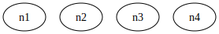

# uGraphMaster - A Graph Manager Powered by Graphviz

Created by me, [Johnny Salazar](https://github.com/itsJohnny21/itsJohnny21), for my CSE 467 (Software QA and Testing) course, taught by professor [Xusheng Xiao](https://xusheng-xiao.github.io/).


## FOR GRADERS ONLY

When I first started on this project, I basically piggy-backed off of the [Nidi3 Graphviz-Java tool](https://github.com/nidi3/graphviz-java) by essentially creating a class that extended Nidi3's MutableGraph class. During testing, I realized that I was really only testing Nidi3's implementation and not my own, and it did not feel right. The project is supposed to help me learn and gain hands-on experience in providing tests for something I've created. That's why I then decided to create my own Graph class from scratch. The MutableGraph from Nidi3 is still used but only for parsing purposes (I could have created my own parser but that would've taken forever).

When creating my own Graph class, I actually implemented all features into a single [commit](https://github.com/itsJohnny21/CSE-464-2024-jsalaz59/commit/5aff7f33336eb0855351c98a046bec7215281423) (since the features were small and related to each other). The methods were still untested, and so another [commit](https://github.com/itsJohnny21/CSE-464-2024-jsalaz59/commit/8242c87ed85042c2bd22a0b19b2abd95931041ec) was made after implementing tests for these features. During the implementation of these tests, I found myself having to improve my code in different ways such as [improving the outputGraph method](https://github.com/itsJohnny21/CSE-464-2024-jsalaz59/commit/145d98d98868637a6ca56c4d4cc0b8f6ee657112), [improving the ID regex for edge cases](https://github.com/itsJohnny21/CSE-464-2024-jsalaz59/commit/6c8a43f93c63bf484a531acb92efcfdd5de81666), [creating a superclass for Graph Node and Edge](https://github.com/itsJohnny21/CSE-464-2024-jsalaz59/commit/a973ccf164dbd4234de62b214d54fab48eb58f35), [adding an exception for parse failure](https://github.com/itsJohnny21/CSE-464-2024-jsalaz59/commit/680cef368c3f76b5c9c118000ea4f0b3fa4ba291), and [much more](https://github.com/itsJohnny21/CSE-464-2024-jsalaz59/commits/master/).

I do apologize for not creating separate commits for each feautre. I did however put a lot of time and effor into this project, and I hope that I don't get deducted points for this.

As for the branches, I did create [four different branches](https://github.com/itsJohnny21/CSE-464-2024-jsalaz59/branches) (excluding the [master branch](https://github.com/itsJohnny21/CSE-464-2024-jsalaz59/tree/master)). The first branch called [JGraphT](https://github.com/itsJohnny21/CSE-464-2024-jsalaz59/tree/JGraphT) used the [JGraphT tools](https://github.com/jgrapht/jgrapht) to parse a DOT file. After struggling with these tools, I decided to look for alternative methods of parsing a DOT file and came across [Nidi3&#39;s tools](https://github.com/nidi3/graphviz-java). I then created a separate branch called [Guru-Nidi-DOT-Parser](https://github.com/itsJohnny21/CSE-464-2024-jsalaz59/tree/Guru-Nidi-DOT-Parser) that piggy-backed off of these tools. I then decided that I should create my own Graph class from scratch and thus I create a separate branch called [Graph-Redo](https://github.com/itsJohnny21/CSE-464-2024-jsalaz59/tree/Graph-Redo). After fully implementing this branch (including testing), I then felt that I was ready to create the README.md which would serve as the documentation for this project. I created a new branch called [documentation](https://github.com/itsJohnny21/CSE-464-2024-jsalaz59/tree/documentation) just for this purpose. Now I'm fully finished with this project (although there is still plenty of room for improvement), and I am ready for the part 2.

During the completion of this project, I made the following merges:

- [Documentation Merge Request](https://github.com/itsJohnny21/CSE-464-2024-jsalaz59/commit/2735147fefcf4d9cb053b338945adee278e344d5)
- [Graph From Scratch Merge Request](https://github.com/itsJohnny21/CSE-464-2024-jsalaz59/commit/5467c5f25098615fa6c5604b4f89a5c33394ffec)
- [Nidi3 Merge Request](https://github.com/itsJohnny21/CSE-464-2024-jsalaz59/commit/947ddc1df629d2beeab807810425d117e1e6b31a)
- [JGrapthT Merge Request](https://github.com/itsJohnny21/CSE-464-2024-jsalaz59/commit/2d74485941bc2400d8fb22f315648fd2b2246c24)

## Dependencies

This project is powered by Maven. To install the necessary dependencies, simply run the `mvn package` command. This will install the following:

- lombok (for setters and getters)
- sl4j-nop (for logging)
- graphviz-java (for parsing DOT files)
- junit-jupiter-engine (for JUnit testing)

After installing these dependencies, you can now begin creating your first graph!

## DOTElement

A `DOTElement` is an abstract class that serves the purpose of allowing its child classes to have [Attributes](#attributes). Any `DOTElement` can also be converted to an equivalent DOT element in the [DOT language](https://graphviz.org/doc/info/lang.html). There are three main types of `DOTElement`: [Graph](#graph), [Node](#node), [Edge](#edge).

### Setting an attribute

To give a `DOTElement` an attribute, you can do so by calling the `setAttribute` method that takes in an attribute (String) and value (String) as its arguments. The attribute and value will then be stored in a HashMap for quick access. The following is an example of setting some attributes for each type of `DOTElement`:

```java
Graph g = new Graph();
g.setAttribute("custom_attribute", "some value");
g.setAttribute(Graph.Attribute.BGCOLOR, "red"); // Setting the "bgcolor" attribute to "red"
// g.setAttribute("bgcolor", "red"); // Equivalent way to set the same attribute
```

### Getting an attribute

To get an attribute from a `DOTElement`, you can use the `getAttribute`, which takes in an attribute (String), and uses it to retrieve the attribute's value.

```java
Graph g = new Graph();
g.setAttribute("custom_attribute", "some value");
g.setAttribute(Graph.Attribute.BGCOLOR, "red");
// g.setAttribute("bgcolor", "red"); // Equivalent way to set the same attribute

g.getAttribute(Graph.Attribute.BGCOLOR); // Retrieve attribute value is "red"
```

### Removing an attribute

Removing an attribute from a `DOTElement` can be achieved using the `removeAttribute` method, which takes in the attribute (String).

```java
Graph g = new Graph();
g.setAttribute("custom_attribute", "some value");
g.setAttribute(Graph.Attribute.BGCOLOR, "red");
// g.setAttribute("bgcolor", "red"); // Equivalent way to set the same attribute

g.removeAttribute(Graph.Attribute.BGCOLOR); // Attribute "bgcolor" removed
```

### Graph Attributes

A `Graph` can be given attributes to store data and change its appearance.

This list of attributes was acquired from the official [Graphviz Graph Attributes page](https://graphviz.org/docs/graph/).

- \_BACKGROUND
- BB
- BEAUTIFY
- BGCOLOR
- CENTER
- CHARSET
- CLASS
- CLUSTERRANK
- COLORSCHEME
- COMMENT
- COMPOUND
- CONCENTRATE
- DAMPING
- DEFAULTDIST
- DIM
- DIMEN
- DIREDGECONSTRAINTS
- DPI
- EPSILON
- ESEP
- FONTCOLOR
- FONTNAME
- FONTNAMES
- FONTPATH
- FONTSIZE
- FORCELABELS
- GRADIENTANGLE
- HREF
- ID
- IMAGEPATH
- INPUTSCALE
- K
- LABEL
- LABEL_SCHEME
- LABELJUST
- LABELLOC
- LANDSCAPE
- LAYERLISTSEP
- LAYERS
- LAYERSELECT
- LAYERSEP
- LAYOUT
- LEVELS
- LEVELSGAP
- LHEIGHT
- LINELENGTH
- LP
- LWIDTH
- MARGIN
- MAXITER
- MCLIMIT
- MINDIST
- MODE
- MODEL
- NEWRANK
- NODESEP
- NOJUSTIFY
- NORMALIZE
- NOTRANSLATE
- NSLIMIT
- NSLIMIT1
- ONEBLOCK
- ORDERING
- ORIENTATION
- OUTPUTORDER
- OVERLAP
- OVERLAP_SCALING
- OVERLAP_SHRINK
- PACK
- PACKMODE
- PAD
- PAGE
- PAGEDIR
- QUADTREE
- QUANTUM
- RANKDIR
- RANKSEP
- RATIO
- REMINCROSS
- REPULSIVEFORCE
- RESOLUTION
- ROOT
- ROTATE
- ROTATION
- SCALE
- SEARCHSIZE
- SEP
- SHOWBOXES
- SIZE
- SMOOTHING
- SORTV
- SPLINES
- START
- STYLE
- STYLESHEET
- TARGET
- TBBALANCE
- TOOLTIP
- TRUECOLOR
- URL
- VIEWPORT
- VORO_MARGIN
- XDOTVERSION

### Node Attributes

A `Node` can be given attributes to store data and change its appearance.

This list of attributes was acquired from the official [Graphviz Node Attributes page](https://graphviz.org/docs/nodes/).

- AREA
- CLASS
- COLOR
- COLORSCHEME
- COMMENT
- DISTORTION
- FILLCOLOR
- FIXEDSIZE
- FONTCOLOR
- FONTNAME
- FONTSIZE
- GRADIENTANGLE
- GROUP
- HEIGHT
- HREF
- ID
- IMAGE
- IMAGEPOS
- IMAGESCALE
- LABEL
- LABELLOC
- LAYER
- MARGIN
- NOJUSTIFY
- ORDERING
- ORIENTATION
- PENWIDTH
- PERIPHERIES
- PIN
- POS
- RECTS
- REGULAR
- ROOT
- SAMPLEPOINTS
- SHAPE
- SHAPEFILE
- SHOWBOXES
- SIDES
- SKEW
- SORTV
- STYLE
- TARGET
- TOOLTIP
- URL
- VERTICES
- WIDTH
- XLABEL
- XLP
- Z

### Edge Attributes

A `Edge` can be given attributes to store data and change its appearance.

This list of attributes was acquired from the official [Graphviz Edge Attributes page](https://graphviz.org/docs/edges/).

- ARROWHEAD
- ARROWSIZE
- ARROWTAIL
- CLASS
- COLOR
- COLORSCHEME
- COMMENT
- CONSTRAINT
- DECORATE
- DIR
- EDGEHREF
- EDGETARGET
- EDGETOOLTIP
- EDGEURL
- FILLCOLOR
- FONTCOLOR
- FONTNAME
- FONTSIZE
- HEAD_LP
- HEADCLIP
- HEADHREF
- HEADLABEL
- HEADPORT
- HEADTARGET
- HEADTOOLTIP
- HEADURL
- HREF
- ID
- LABEL
- LABELANGLE
- LABELDISTANCE
- LABELFLOAT
- LABELFONTCOLOR
- LABELFONTNAME
- LABELFONTSIZE
- LABELHREF
- LABELTARGET
- LABELTOOLTIP
- LABELURL
- LAYER
- LEN
- LHEAD
- LP
- LTAIL
- MINLEN
- NOJUSTIFY
- PENWIDTH
- POS
- SAMEHEAD
- SAMETAIL
- SHOWBOXES
- STYLE
- TAIL_LP
- TAILCLIP
- TAILHREF
- TAILLABEL
- TAILPORT
- TAILTARGET
- TAILTOOLTIP
- TAILURL
- TARGET
- TOOLTIP
- URL
- WEIGHT
- XLABEL
- XLP

### Custom attributes

Each class `Graph`, `Node`, and `Edge` has its own nested Attribute enums and purely exists for convenience. The attribute methods can either take in an appropriate Attribute enum value, or it can take any string (as long it matches the [ID regex](#id-regex)). This means you can add custom attributes if needed.

## ID regex

A valid ID is required for many operations such as creating a `Graph` with a custom ID, creating a `Node`, setting an [Attribute](#attribute) for a `DOTElement`, etc. An ID is considered valid if it matches the ID regex which can be found as a final static variable in the `DotElement` class. This ID regex was acquired from the official [Graphviz Grammar page](https://graphviz.org/doc/info/lang.html).

### Valid ID

- a1 (letters followed by digits are allowed)
- \_a (underscore is allowed)
- 1 (digit can be the first character if the ID only contains digits)

### Invalid ID

- node A (whitespace is not allowed)
- node! ("!" is not allowed)
- 1a (cannot start with a digit if it contains non-numeric characters after it)

## Graph

A `Graph` consists of a set of [Node](#node) and [Edge](#edge) objects and automatically manages these objects when performing node and edge operations such as adding a node, removing a node, adding an edge, etc. Instances of its subclasses, `Node` and `Edge`, can only be created by a `Graph`. This composition relationship ensures that the nodes and edges can only live within a `Graph`. Each method of `Node` and `Edge` (besides the attribute methods) directly calls a method from its `Graph`, ensuring that all node and edge operations are done by the `Graph`. For example, the `connectTo` method of a `Node` simply calls its `Graph`'s `addEdge` method to create this edge.

See [examples](#examples) of creating a Graph.

### Create from scratch

To build a graph from scratch, you can choose from two constructors.

1. Constructor with no parameters. This will automatically give the the graph an ID equal to its Java hash code.

   ```java
   Graph g1 = new Graph();
   ```

2. Constructor with ID (String) parameter. You can manually provide your own ID for the graph.

   ```java
   Graph g2 = new Graph("Master");
   ```

The ID value (which must satisfy the [ID regex](#id-regex)) is final, meaning it cannot be modified after the `Graph` is created.

When [converting](#outputting-a-graph) the `Graph` into a DOT file, the `Graph`'s ID will be used as the name of the `Graph`. For example, [converting](#outputting-a-graph) `g2` into a DOT file will look like:

```dot
digraph Master {

}
```

Notice the graph is a digraph (directed graph). This tool will only create digraphs. Creating a regular graph is not an option. This is because a Graphviz digraph can perform all the functionalities a regular graph can perform, plus some more.

**_Note: As of currently, there is no support for creating undirected edges, but support for this feature will be available some time in the near future._**

### Create from a DOT file

Another way to create a `Graph` is by providing the path of a valid DOT file to the static `parseDOT` method provided by `Graph`. This static method utilizies the [Nidi3 graphviz-java](https://github.com/nidi3/graphviz-java) libarary to parse a DOT file by creating a MutableGraph object from graphviz-java, and then uses that MutableGraph object to add the nodes and edges (including all attributes) to the `Graph`. After parsing is complete, the `Graph` should contain all the nodes, edges, and their respective attributes from the DOT file.

The following is an example of parsing a valid [DOT file](./src/test/resources/DOT/valid/nodesX_Y_ZLabeled/nodesX_Y_ZLabeled.dot):

```Java
String dotPath = "./src/test/resources/DOT/valid/nodesX_Y_ZLabeled/nodesX_Y_ZLabeled.dot";
Graph g = Graph.parseDOT(dotPath);
```

### Add a node

The `Graph` object uses a nested class called `Node` to represent its nodes. There are no public constructors for this `Node` class, ensuring that it can only be created by a `Graph` via the `addNode` method. This method requires an [ID](#id-regex) (String) which will later be used by its `Graph` for quick access.

```java
Graph g = new Graph("Master");
Node n1 = g.addNode("n1"); // Add a node with ID "n1"
```

**_Note: If a node with ID "n1" already existed, this method would have thrown a `NodeAlreadyExists` exception._**

The ID will also be used to represent a node when converting the `Graph` into a DOT file. If we were to convert `g` into a DOT file, it would look like:

<div style="display: flex; flex-direction: row">
    <div
    style="
        display: flex;
        flex-direction: column;
        align-items: center;
        margin-right: 20px;
    "
    >
    <p>DOT</p>
<pre>
digraph Master {
    n1 [];
}
</pre>
    </div>
    <div
        style="
            display: flex;
            flex-direction: column;
            align-items: center;
            margin-left: 20px;
        "
        >
    <p>Visualized</p>
    
    </div>
</div>

Notice the empty brackets next to the node. These empty brackets contain the node's attributes, which in this case, the node has no attributes. To learn how to set and modify attributes for a [Node](#node), see [Attributes](#attributes).

### Check node existance

A `Graph` allows you to check if a `Node` exists. To do this, pass the `Node`'s ID into the `nodeExists` method. The method returns true if the `Node` exists, otherwise false.

```java
Graph g = new Graph("Master");
Node n1 = g.addNode("n1");

System.out.println(g.nodeExists("n1")); // true
System.out.println(g.nodeExists("n2")); // false
```

This method is useful to check if a `Node` exists before removing a `Node`.

### Add multiple nodes

For pure convenience, a `Graph` allows you to add multiple `Node`s. This can be achieved using the `addNodes` method which takes in an array of IDs.

```java
Graph g = new Graph("Master");
g.addNode("n1");
String[] nodeIDs = new String[] { "n2", "n3", "n4" };
// String[] nodeIDs = new String[] { "n1", "n3", "n4" }; // NodeAlreadyExistsException thrown
// String[] nodeIDs = new String[] { "n2", "3_badID", "n4" }; // InvalidIDException thrown
// String[] nodeIDs = new String[] { "n2", "n2", "n4" }; // DuplicateNodeIDException thrown

g.addNodes(nodeIDs); // Add nodes "n2", "n3", and "n4"
```

Converting the graph `g` into a DOT file will result in the following:

<div style="display: flex; flex-direction: row">
    <div
    style="
        display: flex;
        flex-direction: column;
        align-items: center;
        margin-right: 20px;
    "
    >
    <p>DOT</p>
<pre>
digraph Master {
        n1 [];
        n2 [];
        n3 [];
        n4 [];
}
</prev>
    </div>
    <div
        style="
            display: flex;
            flex-direction: column;
            align-items: center;
            margin-left: 20px;
        "
        >
    <p>Visualized</p>
    
    </div>
</div>

**_Note: The IDs have to be unique, otherwise a a `DuplicateNodeIDException` will be thrown._**
**_Note: If a node with one of the provided IDs already exists when executing this method, a `NodeAlreadyExistsException` will be thrown._**
**_Note: If an invalid node ID is provided when executing this method, a `InvalidNodeIDException` will be thrown._**
**_Note: If any of the exceptions is thrown during execution of the method, no nodes will be added._**

### Get a node

To retrieve a `Node` from a `Graph`, you can simply call the `getNode` method and pass in the associated `Node`'s ID.

```java
Graph g = new Graph("Master");
g.addNode("n1");

Node n1 = g.getNode("n1"); // Get the node with ID "n1"
```

This method is useful for getting a `Node` that you don't have a direct reference to.

### Remove a node

A `Graph` can remove a `Node` by calling the `removeNode` method and passing in the `Node`'s [ID](#id-regex). This will also automatically remove any `Edge` associated with this `Node`. An example of a removing a `Node` from a complete digraph of size five is provided:

```java
Graph g = new Graph("Master");
int n = 5;

// Create the complete digraph of size 5
for (int i = 0; i < n; i++) {
    g.addNode(String.valueOf(i));
}

for (int i = 0; i < n; i++) {
    Node srcNode = g.getNode(String.valueOf(i));
    srcNode.getID();
    for (int j = 0; j < n; j++) {
        Node dstNode = g.getNode(String.valueOf(j));
        if (i != j) {
            srcNode.connectTo(dstNode);
        }
    }
}

g.removeNode("4");
// Node n4 = g.getNode("4");
// n4.removeFromGraph(); // An alternative method for removing a node
```

A total of five `Node`s were created with IDs corresponding to their number in the creation process. After the complete digraph of size five was fully created, the `Node` with ID "4" `Node` was removed.

<div style="display: flex; justify-content: center;">
    <div style="display: flex; flex-direction: column; align-items: center;">
        <p>Before</p>
        
    </div>
    <div style="display: flex; flex-direction: column; align-items: center;">
        <p>After</p>
        
    </div>
</div>

Note that another way to remove a `Node` is by calling the `Node`'s `removeFromGraph` method. This method simply calls its `Graph`'s `removeNode` method and passes in its own [ID](#id-regex).

### Add an edge

The `Graph` object has another nested class called `Edge` that represents an directed edge between two `Node`s in the `Graph`. Similarly to a `Node `, there are no public constructors. The `Graph`'s `addEdge` method can be used to create an `Edge` between two `Node`s. Simply provide the IDs of the two `Node`s to do so.

```java
Graph g = new Graph("Master");
Node n1 = g.addNode("n1");
Edge e1 = g.addEdge("n1", "n2"); // Add a directed edge between "n1" and "n2"
// Edge e1 = n1.connectTo(n2); // An alternative method to create the same exact edge using connectTo
// Edge e1 = n2.connectFrom(n1); // An alternative method to create the same exact edge using connectFrom
```

**_Note: If an edge already existed between nodes "n1" and "n2", then this method will throw a `EdgeAlreadyExists` exception._**
**_Note: If using connectTo or connectFrom, both nodes have to be from the same graph, otherwise a `DifferingGraphsException` will be thrown._**

Notice that prior to execution of this method, no `Node` with ID "n2" existed. The `Graph` automatically created this `Node` to make it even easier to create `Graph`s. If you want to check if a `Node` exists, you can use the `nodeExists` method. After creating the `Edge`, it will have an ID "n1 -> n2". This `Edge` ID is automatically created by the static method `createEdgeID` from its `Graph`. This ID is final and will be used to represent an edge when converting the Graph into a DOT file. If we were to convert `g2` into a DOT file, it would look like:

<div style="display: flex; flex-direction: row">
    <div
    style="
        display: flex;
        flex-direction: column;
        align-items: center;
        margin-right: 20px;
    "
    >
    <p>DOT</p>
<pre>
digraph Master {
        n1 [];
        n2 [];<br>
        n1 -> n2 [];
}
</prev>
    </div>
    <div
        style="
            display: flex;
            flex-direction: column;
            align-items: center;
            margin-left: 20px;
        "
        >
    <p>Visualized</p>
    
    </div>
</div>

Another way to add an `Edge` is by using a `Node`'s `connectTo` method. The `Node` that calls the `connectTo` method will be the source `Node`, and the `Node` passed to this method will be the destination `Node`. Or conversely, you can use the `connectFrom` of the destination `Node` and pass in the source `Node`. Either way, the `Graph` will create a directed `Edge` from the source `Node` to the destination `Node`. These alternative methods are commented out in the prior example.

**_Note: If a node with the ID passed into `getNode` does not exist, then a `NodeDoesNotExistException` will be thrown._**

### Check edge existance

To check if an `Edge` exsits between two `Node`s, you can use the `edgeExists` method provided by the `Graph`. Remember, order matters since all `Edge`s are directed edges.

```java
Graph g = new Graph("Master");
Edge e1 = g.addEdge("n1", "n2");

System.out.println(g.edgeExists("n1", "n2")); // true
System.out.println(g.edgeExists("n1", "n1")); // false
```

This method is useful to check if a `Edge` exists before removing it.

### Get an edge

A `Graph` allows you to retrieve an `Edge` through the `getEdge` method which requires the IDs of the `Node`s associated with that `Edge` in the correct order.

```java
Graph g = new Graph("Master");
g.addEdge("n1", "n2");

Edge e = g.getEdge("n1", "n2"); // Get the edge "n1 -> n2"
```

This method is useful for getting an `Edge` that you don't have a direct reference to.

### Remove an edge

To remove an `Edge` from a `Graph`, you can simply use the `removeEdge` method provided by its `Graph`. This method requires the IDs of the two `Node`s connected by the `Edge`. The first parameter is the ID of the source `Node`, and the second parameter is the ID of the destination `Node`. **The order matters!** An example of removing an `Edge` from a complete digraph of size three is provided:

```java
Graph g = new Graph("Master");
int n = 3;

for (int i = 0; i < n; i++) {
    g.addNode(String.valueOf(i));
}

for (int i = 0; i < n; i++) {
    Node srcNode = g.getNode(String.valueOf(i));
    srcNode.getID();
    for (int j = 0; j < n; j++) {
        Node dstNode = g.getNode(String.valueOf(j));
        if (i != j) {
            srcNode.connectTo(dstNode);
        }
    }
}

g.removeEdge("2", "0");
```

A total of three `Node`s were created with IDs corresponding to their number in the creation process. After the complete digraph of size five was complete, the `Edge` "2 -> 0" was removed.

<div style="display: flex; justify-content: center;">
    <div style="display: flex; flex-direction: column; align-items: center;">
        <p>Before</p>
        
    </div>
    <div style="display: flex; flex-direction: column; align-items: center;">
        <p>After</p>
        
    </div>
</div>

### Get number of nodes

For convenience, a `Graph` lets you get the `Node` count by calling the `getNumberOfNodes` method. This effectively returns the size of the graph's nodes HashMap.

```java
Graph g = new Graph("Master");
g.addNodes("n1", "n2", "n3");
g.addEdge("n4", "n5");

System.out.println(g.getNumberOfNodes()); // 5
```

<div style="display: flex; flex-direction: row">
    <div
    style="
        display: flex;
        flex-direction: column;
        align-items: center;
        margin-right: 20px;
    "
    >
    <p>DOT</p>
<pre>
digraph Master {
        n1 [];
        n2 [];
        n3 [];
        n4 [];
}
</prev>
    </div>
    <div
        style="
            display: flex;
            flex-direction: column;
            align-items: center;
            margin-left: 20px;
        "
        >
    <p>Visualized</p>
    
    </div>
</div>

### Get node names

For convenience, a `Graph` lets you get the IDs of its nodes by calling the `getNodeNames` method. This effectively returns the [ID](#ir-regex) of the `Node`s in the nodes HashMap.

```java
Graph g = new Graph("Master");
g.addNodes("n1", "n2", "n3");

System.out.println(g.getNodeNames()); // [n1, n2, n3]
```

<div style="display: flex; flex-direction: row">
    <div
    style="
        display: flex;
        flex-direction: column;
        align-items: center;
        margin-right: 20px;
    "
    >
    <p>DOT</p>
<pre>
digraph Master {
        n1 [];
        n2 [];
        n3 [];
        n4 [];
}
</prev>
    </div>
    <div
        style="
            display: flex;
            flex-direction: column;
            align-items: center;
            margin-left: 20px;
        "
        >
    <p>Visualized</p>
    
    </div>
</div>

### Get node labels

For convenience, a `Graph` lets you get the labels of its `Node`s by calling the `getNodeLabels` method. This returns all the labels of the `Node`s in the nodes HashMap.

```java
Graph g = new Graph("Master");
Node n1 = g.addNode("n1");
Node n2 = g.addNode("n2");

n1.setAttribute(Node.Attribute.LABEL, "n1 label");
n2.setAttribute(Node.Attribute.LABEL, "n2 label");

System.out.println(g.getNodeLabels()); // [n1=n1 label, n2=n2 label]
```

<div style="display: flex; flex-direction: row">
    <div
    style="
        display: flex;
        flex-direction: column;
        align-items: center;
        margin-right: 20px;
    "
    >
    <p>DOT</p>
<pre>
digraph Master {
        n1 [];
        n2 [];
        n3 [];
        n4 [];
}
</prev>
    </div>
    <div
        style="
            display: flex;
            flex-direction: column;
            align-items: center;
            margin-left: 20px;
        "
        >
    <p>Visualized</p>
    
    </div>
</div>

### Get number of edges

For convenience, a `Graph` lets you get the `Edge` count by calling the `getNumberOfEdges` method. This effectively returns the size of the graph's edges HashMap.

```java
Graph g = new Graph("Master");
Node[] nodes = g.addNodes("n1", "n2", "n3");
Node root = g.addNode("root");
for (Node node : nodes) {
    root.connectTo(node);
}

System.out.println(g.getNumberOfEdges()); // 3
```

<div style="display: flex; flex-direction: row">
    <div
    style="
        display: flex;
        flex-direction: column;
        align-items: center;
        margin-right: 20px;
    "
    >
    <p>DOT</p>
<pre>
digraph Master {
        n1 [];
        n2 [];
        n3 [];
        n4 [];
}
</prev>
    </div>
    <div
        style="
            display: flex;
            flex-direction: column;
            align-items: center;
            margin-left: 20px;
        "
        >
    <p>Visualized</p>
    
    </div>
</div>

### Get edge directions

For convenience, a Graph lets you get the `Edge` directions by calling the `getEdgeDirections` method. This returns all the `Edge` [ID](#ir-regex)s from the edges HashMap. An `Edge` ID looks like "node1 -> node2".

```java
Graph g = new Graph("Master");
Node[] nodes = g.addNodes("n1", "n2", "n3");
Node root = g.addNode("root");

for (Node node : nodes) {
    root.connectTo(node);
}

g.getNode("n2").connectTo(g.addNode("n4"));

System.out.println(g.getEdgeDirections()); // [root -> n1, root -> n2, root -> n3, n2 -> n4]
```

<div style="display: flex; flex-direction: row">
    <div
    style="
        display: flex;
        flex-direction: column;
        align-items: center;
        margin-right: 20px;
    "
    >
    <p>DOT</p>
<pre>
digraph Master {
        n1 [];
        n2 [];
        n3 [];
        n4 [];
}
</prev>
    </div>
    <div
        style="
            display: flex;
            flex-direction: column;
            align-items: center;
            margin-left: 20px;
        "
        >
    <p>Visualized</p>
    
    </div>
</div>

### Convert to DOT

Any `Graph` can be converted to an equivalent DOT graph. To do this, you can call the `toDot` method (no arguments). The DOT graph will be a digraph with a name equal to the ID of the `Graph` object. Its `Node`s, `Edge`s, and all associated attributes will be be layed out in sections. As an example, we'll create a complete digraph of size three with attributes and convert it to a DOT graph.

```java
Graph g = new Graph("Master");
g.setAttribute(Graph.Attribute.BGCOLOR, "pink");
int n = 3;
String[] colors = new String[] { "red", "yellow", "orange", "teal", "grey", "blue", "green" };

for (int i = 0; i < n; i++) {
    Node node = g.addNode(String.valueOf(i));
    node.setAttribute(Node.Attribute.LABEL, String.format("I am node %s", i));
    node.setAttribute(Node.Attribute.COLOR, colors[i % colors.length]);
}

for (int i = 0; i < n; i++) {
    Node srcNode = g.getNode(String.valueOf(i));
    srcNode.getID();
    for (int j = 0; j < n; j++) {
        Node dstNode = g.getNode(String.valueOf(j));
        if (i != j) {
            Edge edge = srcNode.connectTo(dstNode);
            edge.setAttribute(Edge.Attribute.COLOR, colors[i % colors.length]);
            edge.setAttribute(Edge.Attribute.LABEL, edge.getID());
            edge.setAttribute(Edge.Attribute.FILLCOLOR, colors[(i + 3) % colors.length]);
        }
    }
}

System.out.println(g.toDot());
```

The equivalent DOT graph is the following:


Notice that the sections are displayed in the following order:

1. `Graph` attributes
2. `Node`s and their attributes
3. `Edge`s and their attributes

### Output graph

A `Graph` can also be converted to a wide variety of formats using the `outputGraph` method which takes in a filepath (String) and a [Format](#format) enum value. If the filepath provided does not end in the extension of the `Format`, it will be automatically added. For example, if the filepath is "mygraph" and the format is `Format.DOT`, the new filepath will be "filepath.dot".

The list of output formats was acquired from the official [Graphviz Output Formats page](https://graphviz.org/docs/outputs/). [Graphviz Output Formats page](https://graphviz.org/docs/outputs/).

An example of converting a graph to a JSON value is provided:

```java
Graph g = new Graph("Master");
g.setAttribute(Graph.Attribute.BGCOLOR, "pink");
int n = 3;
String[] colors = new String[] { "red", "yellow", "orange", "teal", "grey", "blue", "green" };

for (int i = 0; i < n; i++) {
    Node node = g.addNode(String.valueOf(i));
    node.setAttribute(Node.Attribute.LABEL, String.format("I am node %s", i));
    node.setAttribute(Node.Attribute.COLOR, colors[i % colors.length]);
}

for (int i = 0; i < n; i++) {
    Node srcNode = g.getNode(String.valueOf(i));
    srcNode.getID();
    for (int j = 0; j < n; j++) {
        Node dstNode = g.getNode(String.valueOf(j));
        if (i != j) {
            Edge edge = srcNode.connectTo(dstNode);
            edge.setAttribute(Edge.Attribute.COLOR, colors[i % colors.length]);
            edge.setAttribute(Edge.Attribute.LABEL, edge.getID());
            edge.setAttribute(Edge.Attribute.FILLCOLOR, colors[(i + 3) % colors.length]);
        }
    }
}

g.outputGraph("./assets/graphs/outputGraphToJSON", Format.JSON); // New filepath is ./assets/graphs/outputGraphToJSON.json
```

## Node

A `Node` can only be created from a `Graph` object via the `addNode` method. It also needs to reference its `Graph` in order to call the appropriate methods. For example, calling the `connectTo` method calls its `Graph`'s `addEdge` method. All of the methods provided by `Node` (excluding the [Attribute](#attribute) methods) follow this design pattern to ensure that it's strictly the `Graph` that manages the nodes and edge operations. The methods provided by `Node` are purely for convenience and are by no means necessary for the functionality of Graph.

A `Node` also stores its 'to' and 'from' `Edge`s for efficient `Node` and `Edge` operations. A 'to' `Edge` reefers to an `Edge` where the `Node` itself is the source `Node`. In contrast, a 'from' `Edge` refers to an `Edge` where the `Node` itself is a destination `Node`.

### Connect to another node

You can connect one `Node` to another by calling the `connectTo` method. This method takes in the destination `Node` and these two `Node`s **must** share the same graph. Under the hood, this method is calling its graph's `addEdge` method, and creates an `Edge` in the format: "calling node -> parameter node".

```java
Graph g = new Graph("Master");
Node n1 = g.addNode("n1");
Node n2 = g.addNode("n2");

n1.connectTo(n2); // Edge created: "n1 -> n2"
```

**_Note: If the graphs of both nodes do not match, then a `DifferingGraphsException` will be thrown._**

<div style="display: flex; flex-direction: row">
    <div
    style="
        display: flex;
        flex-direction: column;
        align-items: center;
        margin-right: 20px;
    "
    >
    <p>DOT</p>
<pre>
digraph Master {
        n1 [];
        n2 [];<br>
        n1 -> n2 [];
}
</div>

### Connect from another node

The `connectFrom` method is similar to `connectTo` in that you provide a another `Node`, and an `Edge` is created between the two `Node`s. For this method, you specify the source `Node` to create the `Edge`: "parameter node -> calling node".

```java
Graph g = new Graph("Master");
Node n1 = g.addNode("n1");
Node n2 = g.addNode("n2");

n1.connectFrom(n2); // Edge created: "n2 -> n1"
```

**_Note: If the graphs of both nodes do not match, then a `DifferingGraphsException` will be thrown._**

<div style="display: flex; flex-direction: row">
    <div
    style="
        display: flex;
        flex-direction: column;
        align-items: center;
        margin-right: 20px;
    "
    >
    <p>DOT</p>
<pre>
digraph Master {
        n1 [];
        n2 [];<br>
        n2 -> n1 [];
}
</div>

### Get a 'to' edge

A `Node` allows you to access its 'to' `Edge`s using the `to` method that accepts a `Node` object. A 'to' `Edge` refers to an `Edge` where the other `Node` is the destination `Node`.

```java
Graph g = new Graph("Master");
Node n1 = g.addNode("n1");
Node n2 = g.addNode("n2");

n1.connectTo(n2);
Edge edge = n1.to(n2); // Retrieve the edge "n1 -> n2"
```

**_Note: If a node object is passed that is not part of its 'to' edges, then a `EdgeDoesNotExistException` will be thrown._**

### Get a 'from' edge

A `Node` allows you to access its 'from' `Edge`s using the `from` method that accepts a `Node` object. A 'from' `Edge` refers to an `Edge` where the other `Node` is the source `Node`.

```java
Graph g = new Graph("Master");
Node n1 = g.addNode("n1");
Node n2 = g.addNode("n2");

n1.connectTo(n2);
Edge edge = n2.from(n1); // Retrieve the edge "n1 -> n2"
```

### Disconnect from a 'to' node

If an `Edge` "n1 -> n2" exists, then the `Node` with ID "n1" can disconnect from "n2", removing the `Edge` "n1 -> n2". To do this, you can call the `disconnectTo` method provided by the `Node`. The method takes in a reference to the other `Node` as an argument.

```java
Graph g = new Graph("Master");
Node n1 = g.addNode("n1");
Node n2 = g.addNode("n2");

n1.connectTo(n2);
n1.disconnectTo(n2); // Removes the edge "n1 -> n2"
```

### Disconnect from a 'from' node

If an `Edge` "n1 -> n2" exists, then the `Node` with ID "n2" can disconnect from "n1", removing the `Edge` "n1 -> n2". To do this, you can call the `disconnectFrom` method provided by the `Node`. The method takes in a reference to the other `Node` as an argument.

```java
Graph g = new Graph("Master");
Node n1 = g.addNode("n1");
Node n2 = g.addNode("n2");

n1.connectTo(n2);
n2.disconnectFrom(n1); // Removes the edge "n1 -> n2"
```

### Remove from graph

A `Node` can remove itself from a `Graph` using the `removeFromGraph` method, which takes no arguments. As a result, the node's `Graph` reference will be set to null since it is no longer part of that `Graph`.

```java
Graph g = new Graph("Master");
Node n1 = g.addNode("n1");

n1.removeFromGraph(); // Removes the node with "n1"
```

## Edge

An `Edge` is a directed edge and stores references to its source `Node` and destination `Node`. An `Edge` can only be created by a `Graph` to ensure `Edge` operations perform correctly. The only method (excluding its [Attribute](#attributes) methods) is the `removeFromGraph` method. More methods may be provided in the future.

### Remove from graph

An `Edge` can be removed from a `Graph` by calling the `removeFromGraph` method which takes no arguments. Behind the scenes, the `removeEdge` method will be called from the `Graph` that `Edge` lives is. The `Node`'s 'to' and 'from' HashMaps will also be updated appropriately to reflect the removal of this `Edge`.

```java
Graph g = new Graph("Master");
Edge e1 = g.addEdge("n1", "n2");

e1.removeFromGraph(); // Removes the edge "n1 -> n2"
```

## Format

A `Graph` can be converted to a variety of formats. For convenience, this `Format` enum class allows you to quickly access these formats.

This list of valid formats was acquired from the official [Graphviz Output Format page](https://graphviz.org/docs/outputs/).

- BMP
- DOT
- JPEG
- JSON
- PDF
- PICT
- PLAINTEXT
- PNG
- SVG
- RAWDOT

## Example

Below are some examples demonstrating the capabilities of this tool.

### Logo

How the GraphMaster logo was created:

```java
package examples;

import org.CSE464.Format;
import org.CSE464.Graph;
import org.CSE464.Graph.Node;

public class Logo {

    public static void main(String[] args) throws Exception {
        String s1 = "Graph"; // Will be used to create a string of nodes that display 'Graph'
        String s2 = "Master"; // Will be used to create a string of nodes that display 'Master'
        String intersectionCharacter = "a"; // Where the string of nodes should intersect
        double radius = 0.5; // Size of a node
        double angle = Math.PI / 4; // The angle of the string of nodes

        Graph g = intersectStrings(s1, s2, intersectionCharacter, radius, angle); // Returns a graph where the string of nodes sharing an intersection character are display as two strings of nodes, one for each string provided
        g.setAttribute(Graph.Attribute.BGCOLOR, "gray84:gray94"); // Color of the background

        for (Node n : g.getNodes()) {
            n.setAttribute(Node.Attribute.FONTNAME, "San Francisco"); // Change the font name of the node
        }

        g.outputGraph("./assets/icons/logo", Format.SVG); // Output the logo as SVG
    }

    public static void setNodeAttributes(Node n, String label, double xPos, double yPos, double radius) {
        n.setAttribute(Node.Attribute.LABEL, label); // Set the 'label' attribute
        n.setAttribute(Node.Attribute.POS, String.format("%s,%s", xPos, yPos)); // Set the 'pos' attribute
        n.setAttribute(Node.Attribute.WIDTH, String.format("%s", radius)); // Set the 'width' attribute
        n.setAttribute(Node.Attribute.HEIGHT, String.format("%s", radius)); // Set the 'height' attribute
    }

    public static Graph intersectStrings(String s1, String s2, String intersectionCharacter, double radius,
            double angle) throws Exception {
        Graph g = new Graph();
        int intersectionIndex1 = s1.indexOf(intersectionCharacter); // Index of intersetion character for string1
        int intersectionIndex2 = s2.indexOf(intersectionCharacter); // Index of intersetion character for string2

        if (intersectionIndex1 == -1 || intersectionIndex2 == -2) { // Both strings must contain the intersection character
            throw new RuntimeException("Strings do not share the intersection character");
        }

        double prevXPos = 0; // Initial position for x
        double prevYPos = 0; // Initial position for y

        Node prevNode = g.addNode("0"); // Create the first node with id '0'
        setNodeAttributes(prevNode, String.valueOf(s1.charAt(0)), prevXPos, prevYPos, radius); // Set the attributes of the first node

        for (int i = 1; i < s1.length(); i++) {
            Node nextNode = g.addNode(String.format("%d", g.getNumberOfNodes())); // Next node that will be connected as prevNode -> nextNode

            prevXPos += Math.cos(angle) * 4 * radius; // Update the x position
            prevYPos += Math.sin(angle) * 4 * radius; // Update the y position

            setNodeAttributes(nextNode, String.valueOf(s1.charAt(i)), prevXPos, prevYPos, radius); // Set the attributes of nextNode
            prevNode.connectTo(nextNode); // Create the edge
            prevNode = nextNode; // Update the prevNode
        }

        Node pivotNode = g.getNode(String.format("%d", intersectionIndex1)); // Pivot node where the intersection is made
        pivotNode.setAttribute(Node.Attribute.COLOR, "red"); // Change the color of the pivot node to red

        String[] pivotNodePosString = pivotNode.getAttribute(Node.Attribute.POS).split(","); // Get the x and y positions of the pivot node
        double pivotNodeXPos = Double.parseDouble(pivotNodePosString[0]); // Store the x position of the pivot node
        double pivotNodeYPos = Double.parseDouble(pivotNodePosString[1]); // Store the y position of the pivot node

        prevXPos = pivotNodeXPos + Math.cos(angle + Math.PI / 2) * 4 * radius * intersectionIndex2; // Update the x position so that it is at it's appropriate location. It will be length of string 2 minus intersection index 2 positions away in the x direction
        prevYPos = pivotNodeYPos + Math.sin(angle + Math.PI / 2) * 4 * radius * intersectionIndex2; // Update the y position so that it is at it's appropriate location. It will be length of string 2 minus intersection index 2 positions away in the y direction
        prevNode = intersectionIndex2 == 0 ? pivotNode : g.addNode(String.format("%d", s1.length())); // Check if the first character of string 2 is the intersection character and make it the pivot node if so

        setNodeAttributes(prevNode, String.valueOf(s2.charAt(0)), prevXPos, prevYPos, radius); // Set attributes of prevNode

        for (int i = 1; i < s2.length(); i++) {
            Node nextNode = intersectionIndex2 == i ? pivotNode
                    : g.addNode(String.format("%d", g.getNumberOfNodes() + 1)); // Check if the next node is the pivot node

            prevXPos += -Math.cos(angle + Math.PI / 2) * 4 * radius; // Update the x position
            prevYPos += -Math.sin(angle + Math.PI / 2) * 4 * radius; // Update the y position

            setNodeAttributes(nextNode, String.valueOf(s2.charAt(i)), prevXPos, prevYPos, radius); // Set attributes of nextNode
            prevNode.connectTo(nextNode); // Create the edge prevNode -> nextNode
            prevNode = nextNode; // Update the prevNode
        }

        return g; // Return graph containing the intersected string of nodes
    }
}
```
